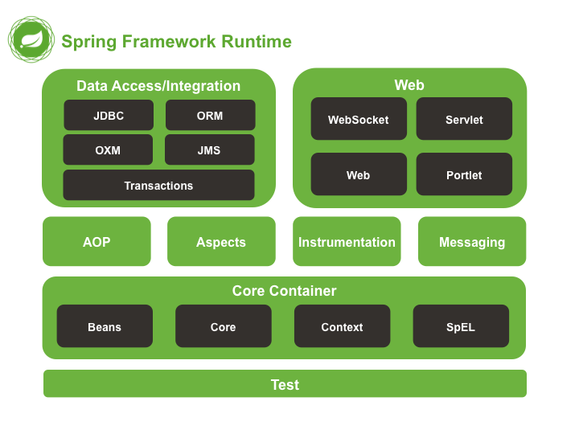

# Spring Core
Spring posee diversos módulos que se pueden agregar a las aplicaciones Java. Cada desarrollador agrega los módulos que necesite.

:::tip SPRING CORE
**Spring Core** es el núcleo de Spring, es el **único módulo que tenemos que agregar para que Spring funcione**.

:::

Spring Core contiene:

* la **DI (inyección de dependencias)** y
* la configuración y uso de objetos Java.

Muchas aplicaciones sólo necesitan de Spring Core sin necesidad de agregar módulos adicionales.

Otros módulos conocidos son:

* **AOP**: para trabajar con aspectos,
* **DAO**: para trabajar con base de datos,
* **MVC**: para la capa web,
* **Portlet MVC**: para trabajar con portlets,
* **JMS**: para mensajería y
* **Security**: para el manejo de seguridad.

Como se puede observar Spring nos da muchas opciones para poder agregar a nuestro proyecto. Estos no son los únicos módulos que nos ofrece Spring, sólo son los más importantes.

## Componentes de Spring
Spring Boot ofrece una serie de componentes que ayudan a la hora de crear aplicaciones web de forma rápida y sencilla.

Los componentes principales se etiquetarán con @ para que el framework Spring lo reconozca (módulo de inversión de control y posterior inyección de dependencias).

Cada uno tiene una misión en la arquitectura:

**Controladores**: Se etiquetan como ``@Controller`` o, en el caso de implementar una API REST como ``@RestController``. Estos son los encargados de recibir las peticiones de los usuarios y devolver respuestas.

**Servicios**: Se etiquetan como ``@Service``. Se encargan de implementar la parte de negocio o infraestructura. En nuestro caso puede ser el sistema de almacenamiento o parte de la seguridad y perfiles de usuario.

**Repositorios**: Se etiquetan como ``@Repository`` e implementan la interfaz y operaciones de persistencia de la información. En nuestro caso, puede ser una base de datos o una API externa. Podemos extender de repositorios preestablecidos o diseñar el nuestro propio.

**Configuración**: Se etiquetan como ``@Configuration``. Se encargan de configurar los componentes de la aplicación. Se se suelen iniciar al comienzo de nuestra aplicación.

**Bean**: La anotación ``@Bean``, sirven para indicar que este bean será administrado por Spring. Su administración se realiza mediante anotaciones como ``@Configuration``. De esta manera cuando se pida un objeto y esté anotado como ``@Bean``, Spring se encargará de crearlo y devolverlo.