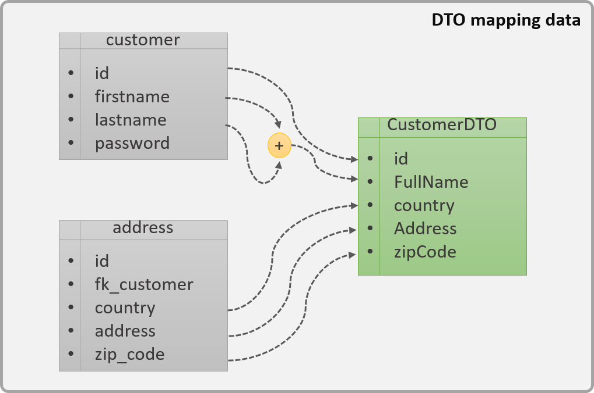

# Patrón DTO

:::tip DTO
Los **dto** son objetos que se usan para transportar datos entre capas.

:::

Sus **principales usos** son:

* Evitar exponer las entidades de la base de datos o los modelos de nuestra aplicación.
* Permitir ensamblar distintos objetos.
* Eliminar campos que no queremos que se vean.
* Pasar de un tipo de dato a otro.

En cuanto a sus **características**:

* **Solo lectura**: al ser utilizado únicamente para transferencia de datos, es importante evitar tener operaciones de negocio o método que realicen cálculos sobre los datos, es por ello que únicamente deberían tener métodos get y set.
* **Serializable**: al tener que viajar los objetos por la red, deberán de poder ser serializables. No solo la clase, si no también los atributos por lo que será necesario utilizar tipos de datos que también sean serializables.
  
Imaginemos que en una base de datos disponemos de dos tablas ``Customer`` y ``Address``. De esas dos tablas queremos devolver un objeto que tenga alguno de los atributos de esas tablas, sin la necesidad de devolverlos todos, por ejemplo, los siguientes campos como indica la siguiente imagen



Lo primero que tendremos que hacer es mapear las dos tablas implicadas a objetos Java.

<details>
<summary>Customer.java</summary>

```java
import javax.persistence.Column;
import javax.persistence.Entity;
import javax.persistence.GeneratedValue;
import javax.persistence.GenerationType;
import javax.persistence.Id;
import javax.persistence.Table;

@Entity
@Table(name="customers")
public class Customer {
	@Id
	@GeneratedValue(strategy= GenerationType.IDENTITY)
	private Long id;
	@Column(name="firstname")
	private String firstname;
	@Column(name="lastname")
	private String lastname;
	@Column(name="password")
	private String password;
	
	/** GET and SET */
}
```
</details>
<details>
<summary>Address.java</summary>

```java
import javax.persistence.Column;
import javax.persistence.Entity;
import javax.persistence.GeneratedValue;
import javax.persistence.GenerationType;
import javax.persistence.Id;
import javax.persistence.JoinColumn;
import javax.persistence.ManyToMany;
import javax.persistence.Table;

@Entity
@Table(name="address")
public class Address {
	@Id
	@GeneratedValue(strategy=GenerationType.IDENTITY)
	private Long id;
	@ManyToMany()
	@JoinColumn(name="fk_customer")
	private Customer customer;
	@Column(name="country")
	private String country;
	@Column(name="address")
	private String address;
	@Column(name="zipcode")
	private String zipCode;
		
	/** GET and SET */
}

```
</details>

Por otro lado, creamos el objeto DTO:

<details>
<summary>CustomerDTO.java</summary>

```java
import java.io.Serializable;

public class CustomerDTO implements Serializable{
	
	private Long id;
	private String FullName;
	private String country;
	private String Address;
	private String zipCode;
	
	/** GET and SET */
}
```
</details>

Un ejemplo de su uso sería el siguiente:

<details>
<summary>CustomerService.java</summary>

```java
import javax.ejb.EJB;
import javax.ejb.Stateless;
import javax.ws.rs.GET;
import javax.ws.rs.Path;
import javax.ws.rs.PathParam;
import javax.ws.rs.core.MediaType;
import javax.ws.rs.core.Response;

@Path("customers")
public class CustomerService {
	
	@Autowired
	private CustomerRepository customerRepository; // Habría que crear esta clase
	@Autowired
	private AddressRepository addressRepository; // Habría que crear esta clase

	@GET
	@PathParam("{customerId}")
	private Response findCustomer(@PathParam("customerId") Long customerId) {
        // Obtención de la información de la base de datos
		Customer customer = customerRepository.findCustomerById(customerId); // Entity
		Address address = addressRepository.findAddressByCustomer(customerId); //Entity
		
		//Creación del DTO
		CustomerDTO dto = new CustomerDTO();
		dto.setAddress(address.getAddress());
		dto.setCountry(address.getCountry());
		dto.setZipCode(address.getZipCode());
		dto.setFullName(customer.getFirstname() + " " + customer.getLastname());
		dto.setId(customer.getId());
		
		//Envío del DTO junto con la cabecera de estado
		return Response.ok(dto, MediaType.APPLICATION_JSON).build();

		/*
		También podríamos usar ResponseEntity.ok(dto) y cambiar el tipo del método de Response findCustomer 
		a ResponseEntity<CustomerDTO> findCustomer
		*/
	}
}
```
</details>

:::warning ENVÍO DE LAS ENTIDADES COMO RESPUESTA
No es una buena práctica utilizar las clases de Entidad para la transmisión de datos entre el cliente y el servidor.

Las Entidades son diseñadas para representar el modelo de datos, no para ser una vista para una pantalla o servicio determinado. Además, estas no tienen porqué disponer de todos los campos ni tienen porqué ser Serializables.
:::

