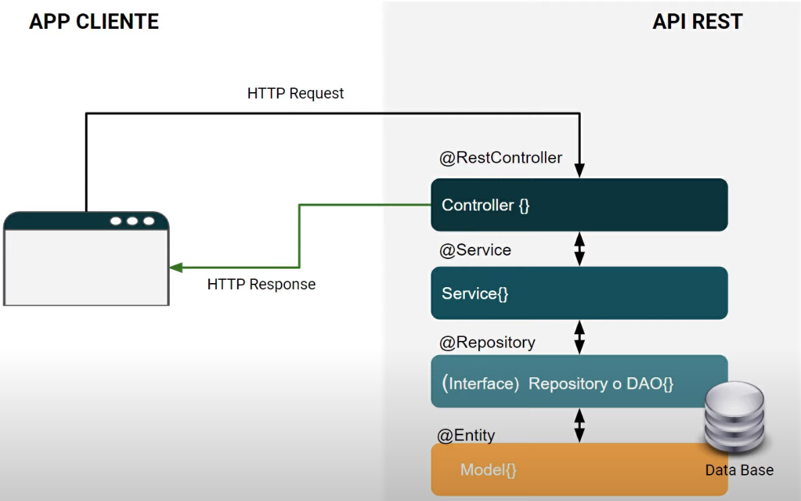
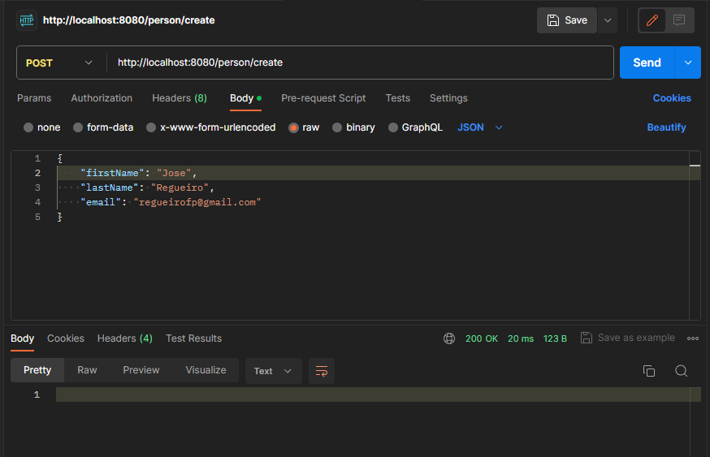
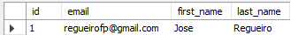

# API RESTFul con Spring
:::tip REST, RESTFUL, API RESTFUL
Es importante aclarar la diferencia entre estos conceptos que se suelen encontrar muy a menudo.

* **REST**: hace referencia a un estilo de arquitectura de software para realizar la comunicación cliente-servidor.

* **RESTFul**: hace referencia a la implementación de una arquitectura REST.

* **API RESTFul**: define una API diseñada usando la arquitectura REST.
:::

A la hora de crear una API Rest en Spring es necesario tener clara la estructura a implementar. Como en la mayoría de las aplicaciones de Spring vamos a seguir una arquitectura basada en multicapas siguiente un modelo MVC.

A continuación, se muestra este una imagen de la arquitectura:



En esta arquitectura se puede ver:

* Un **Controlador**: 
    * Atiende las peticiones HTTP y las deriva a la capa que corresponda, esperará por la respuesta, la generará y la devolverá.
    * Se modela con la anotación ``@RestController``
* Un **Servicio**: 
    * Implementa la lógica de negocio, es decir, donde se implementan las reglas, las funciones y las operaciones del negocio.
    * Se modela con la anotación ``@Service``
* Un **Repositorio**:
    * Encargada de persistencia de los datos, es decir, el resultado de la interacción del modelado de las clases desarrolladas y la propia base de datos.
    * Se modela con la anotación ``@Repository``
* Las **Entidades**:
    * Cada clase se modela a un objeto de la vida real.
    * Se modela con la anotación ``@Entity``

## Creación de la API RESTful con Spring
Para realizar la explicación de estos conceptos, se buscará crear una API RESTful que permita realizar un CRUD básico sobre los datos de una tabla ``Personas``.

En primer lugar, se crea un proyecto nuevo de Spring Initializr con las siguientes dependencias:

* Spring Boot DevTools
* Lombok
* Spring Web
* H2 Database
* MySQL Driver
* Spring Data JPA

:::info EJEMPLO DE PROYECTO VACÍO
[Aquí](D:\DAW\docusaurus\my-website\assets\apirest-892475b9ceac1365bc5117670863744d.zip) puedes descargar el proyecto vacío con las dependencias cargadas con el que se comienza la explicación.


:::

:::warning USO DE LOMBOK
Para facilitar la legibilidad del código y reducir líneas se ha introducido la dependencia Lombok que facilita la creación de clases al no ser necesario añadir los setters, los getters y los constructores.

Aquí podéis ver más en detalle como funciona Lombok y cómo este permite agilizar la creación de clases.

Para usarla será necesaria añadirla a maven. Si se descargó el proyecto anterior, esta dependencia ya viene añadida.
<details>
<summary>Dependencia Lombok Maven</summary>

```xml
<dependency>
    <groupId>org.projectlombok</groupId>
    <artifactId>lombok</artifactId>
    <version>1.18.30</version>
    <scope>provided</scope>
</dependency>
```
</details>
:::

Empezaremos a crear las clases siguiendo el modelo de capas anterior de abajo hacia arriba.

1. Creamos la Entidad denominada ``Person``, con los atributos que nos interesen y indicando que la clase es una Entidad con la anotación ``@Entity``
<details>
<summary>Person.java</summary>

```java
package com.jose.apirest.Person;

import jakarta.persistence.*;
import lombok.AllArgsConstructor;
import lombok.Data;
import lombok.NoArgsConstructor;

@Data
@AllArgsConstructor
@NoArgsConstructor
@Entity
public class Person {
    @Id
    @GeneratedValue(strategy = GenerationType.IDENTITY)
    private Integer id;
    private String firstName;
    private String lastName;
    private String email;
}
```
</details>

2. Creamos una base de datos vacía, en este caso llamada ``apirest``.
```java
CREATE DATABASE apirest;
```
3. Creación del Repositorio, llamado ``PersonRepository`` que al ser un repositorio será una interfaz que será marcada con la anotación ``@Repository`` y extenderá de JpaRepository para tener acceso a todos los métodos CRUD que ofrece esa interfaz.
<details>
<summary>PersonRepository.java</summary>

```java
package com.jose.apirest.Person;

import org.springframework.data.jpa.repository.JpaRepository;
import org.springframework.stereotype.Repository;

@Repository
public interface PersonRepository extends JpaRepository<Person, Integer> {

}
```
</details>

4. Modificar el archivo application.properties para configurar los parámetros de la base de datos.

```
spring.datasource.url=jdbc:mysql://localhost:3306/apirest
spring.datasource.username=root
spring.datasource.password=abc123.
spring.jpa.database-platform=org.hibernate.dialect.MySQL8Dialect
spring.jpa.hibernate.ddl-auto=update
```

5. Creación del Servicio, para ello se crea una clase denominada ``PersonService`` que estará marcada con la anotación ``@Service``. Este servicio tendrá que proporcionar los servicios al controlador para ello proporcionará los endpoints por rutas.

<details>
<summary>PersonService.java</summary>

```java
package com.jose.apirest.Person;

import lombok.RequiredArgsConstructor;
import org.springframework.stereotype.Service;

@Service
@RequiredArgsConstructor
public class PersonService {

    private final PersonRepository personRepository;

    public Person createPerson(Person person){
        return personRepository.save(person);
    }

    public Person findById(Integer id){
         return personRepository.findById(id).orElse(null);
    }

    public void delete(Integer id){
        personRepository.deleteById(id);
    }

    public Person updatePerson(Person person){
        return personRepository.save(person);
    }
}
```
</details>

6. Creamos el Controlador, se crea una nueva clase llamada ``PersonController`` que estará marcada con la anotación ``@RestController`` que publicará todos los endpoints que son las rutas que están a disposición de los clientes para el acceso a los datos o a una funcionalidad.

El controlador debe ser capaz de interpretar los mensajes recibidos del navegador, es decir, los mensajes que se pueden enviar por el protocolo HTTP para eso hará uso de diferentes anotaciones:

* Para indicar el método HTTP utilizado podremos usar: ``@PostMapping``, ``@GetMapping``, ``@RequestMapping``, ``@DeleteMapping``, ``@PutMapping``, ``@PatchMapping`` haciendo mención a la utilización de los métodos: post, get, request, delete, put y patch respectivamente.

* Especificar la ruta de acceso:

    * Ruta absoluta al fichero del controlador: utilizando la notación ``@RequestMapping`` antes de la creación de la clase y indicando la ruta de acceso entre paréntesis.
    * Ruta de acceso a la función: utilizando las cabeceras de los métodos HTTP o bien indicando la cabecera y la ruta entre paréntesis.
* Indicar de dónde se van a obtener los parámetros de entrada. Para ello podemos utilizar las siguiente anotaciones:

    * ``@PathVariable``: a través de la propia ruta
    * ``@RequestParam``: a través de parámetros
    * ``@RequestBody``: a través del cuerpo del mensaje

* Indicar cómo se va a responder, para ello utilizaremos la anotación ``@ResponseBody``

<details>
<summary>PersonController.java</summary>

```java
package com.jose.apirest.Person;

import lombok.RequiredArgsConstructor;
import org.springframework.web.bind.annotation.*;

@RestController
@RequestMapping("/person")
@RequiredArgsConstructor
public class PersonController {

    private final PersonService personService;
    @PostMapping("/create")
    public Person createPerson(@RequestBody Person person){
        return personService.createPerson(person);
    }

    @DeleteMapping("/{id}")
    public void deletePerson(@PathVariable Integer id){
        personService.delete(id);
    }

    @GetMapping("/{id}")
    public Person findById(@PathVariable Integer id){
        return personService.findById(id);
    }

    @PostMapping("/update")
    public Person updatePerson(@RequestBody Person person){
        return personService.updatePerson(person);
    }
}
```
</details>

:::info EJEMPLO DEL PROYECTO FINALIZADO
[Aquí](assets\apirest_finalizado-68a0c0e7b8f50e08e9f095cf83305a3e.zip) os dejo un ejemplo del proyecto finalizado. No obstante, en el vídeo que os dejo más abajo podéis ver el proceso para la obtención del código.

:::

Para probar el sistema podemos utilizar cualquier tipo de sistema que nos permita crear peticiones HTTP, por ejemplo, PostMan o Swagger (este último se verá con más detalle en el apartado de SpringDoc):



Vemos que el código de estado recibido es el 200 lo que implica que la acción se realizó correctamente. Aún así, podemos verificar si los datos se han introducido correctamente en la base de datos:



:::danger VIDEO EXPLICATIVO
Toda la información de este tutorial fue obtenido del siguiente vídeo donde se explica de forma clara y concisa todo el proceso en detalle.
<iframe width="560" height="315" src="https://www.youtube.com/embed/wT-hIeYyxBg?si=GKSbJB0qBRAQkEsv" title="YouTube video player" frameborder="0" allow="accelerometer; autoplay; clipboard-write; encrypted-media; gyroscope; picture-in-picture; web-share" referrerpolicy="strict-origin-when-cross-origin" allowfullscreen></iframe>

:::

## Envío de respuestas y código de estado

En el controlador anterior, las consultas no tienen en cuenta el estado de HTTP a la hora de responder. Para evitar eso podemos utilizar la clase ``ResponseEntity`` esta clase tiene los siguientes métodos:

* ok(body): para indicar que el mensaje es correcto
* notFound(): indica que el mensaje no existe
* internalServerError(): indica que se ha producido un error durante la obtención de la respuesta
* badRequest(): indica que la petición no se ha realizado correctamente.
* status(httpStatus).body(body)

Dentro de la opción httpStatus existen las siguientes opciones:
* HttpStatus.ACCEPTED
* HttpStatus.BAD_REQUEST
* HttpStatus.FORBIDDEN
* HttpStatus.CREATED
* etc

De tal forma que cualquiera de los métodos del controlador puede ser modificado de la siguiente forma:

* Usando ``ok()``:
```java
@PostMapping("/update")
public ResponseEntity<Person> updatePerson(@RequestBody Person person){
    return ResponseEntity.ok(personService.updatePerson(person));
}
```

* Usando ``status()``
```java
@PostMapping("/update")
public ResponseEntity<Person> updatePerson(@RequestBody Person person){
    return ResponseEntity.status(HttpStatus.ACCEPTED).body(personService.updatePerson(person));
}
```