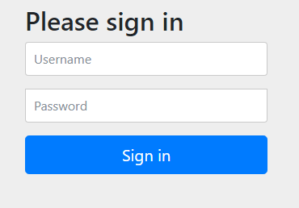

# Seguridad básica

Como siempre, una de las partes más importantes de una aplicación es la seguridad que esta dispone. Spring permite gestionar esta seguridad de forma muy fácil.

Lo primero que tenemos que hacer es importar la dependencia ``Security`` en maven:

```xml
<dependency>
    <groupId>org.springframework.boot</groupId>
    <artifactId>spring-boot-starter-security</artifactId>
</dependency>
```

Una vez importadas y recargadas las dependencias ya tendremos una capa de seguridad sobre nuestra aplicación.

Si seguimos con el ejemplo de los libros, añadimos la capa de seguridad y lo ejecutamos veremos que directamente nos sale una página de login



Por defecto, el usuario utilizado es **user**. En cuanto a la contraseña, esta se genera de forma aleatoria y se muestra en el log de ejecución del programa, en una línea con el siguiente formato:
```
Using generated security password: 7be1f2d2-7e50-484c-8438-8ac553e8e351
```


