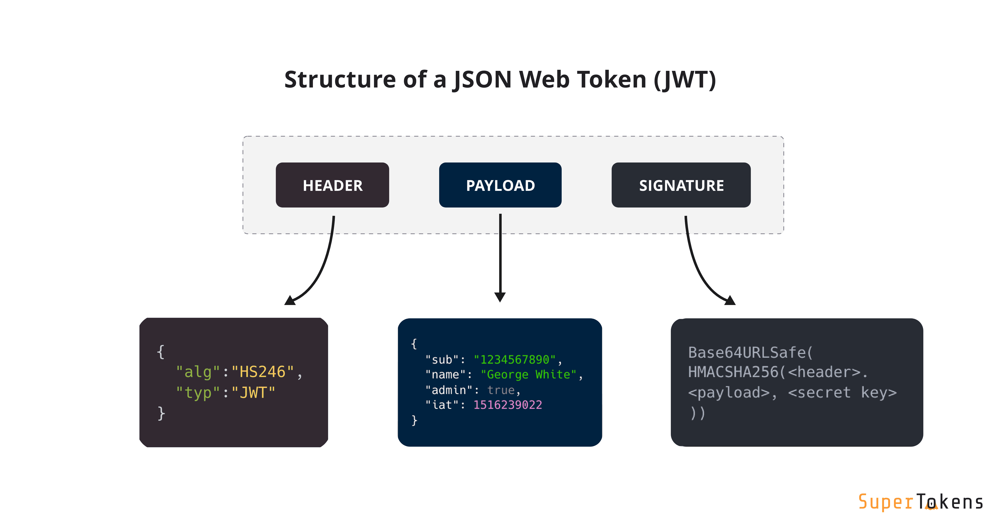
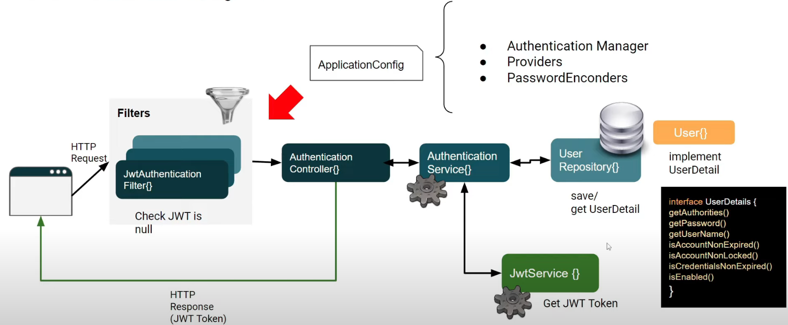
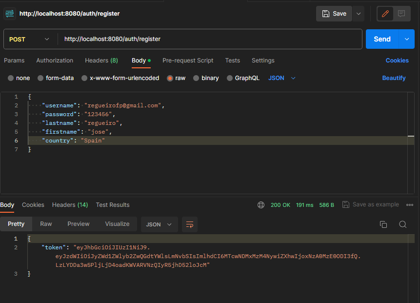
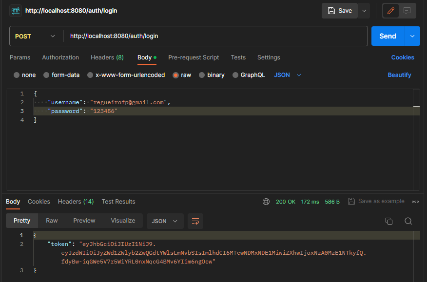

# Spring Security + JWT

:::tip JWT
**JWT** consiste en una cadena de caracteres que codifican información del usuario.

Eta cadena de caracteres o token permite autenticar y no autorizar, es decir, verifica la identidad del usuario pero no garantiza que se tenga acceso a los recursos.
:::



En la imagen anterior, se pueden ver las tres partes de las que está formado la cadena JWT:

1. **El encabezado (header)**: contiene información sobre el tipo de token y el algoritmo utilizado.
2. **La carga útil (payload)**: contiene los datos de sesión como el ID de usuario, roles y permisos. Así, como cualquier otro dato que se quiera almacenar
3. **La firma (signature)**: permite verificar la validez del token para comprobar que no ha sido modificado.

## Proceso de Autenticación/Registro con JWT
A continuación, describiremos el proceso de autenticación y registro de JWT, el cual se puede ver en la siguiente imagen:



1. Realización de petición HTTP que llama al controlador.
2. El controlador utiliza un filtro JWTAuthenticationFilter el cual comprueba si es nulo. Si lo es, el filtro concluye sin problemas.
3. El controlador invoca al servicio de autenticación quien, para el caso del registro de usuario, va a guardar un nuevo registro en la base de datos.
4. Para el servicio de login, este buscará en la base de datos el usuario correspondiente, por lo tanto, es necesario que exista la entidad Usuario.
5. Se genera el token y se devuelve la respuesta con el token en el cuerpo del mensaje.

Al no estar usando la configuración por defecto, será necesario implementar:

* Authentication Manager
* Provider
* PasswordEncoders.

## Implementación en Java
:::warning ESTADO DEL FICHERO APPLICATION.PROPERTIES
```properties
spring.datasource.url=jdbc:mysql://localhost:3306/books
spring.datasource.username=root
spring.datasource.password=abc123.
spring.jpa.database-platform=org.hibernate.dialect.MySQL8Dialect
spring.jpa.hibernate.ddl-auto=update
```
:::

Lo primero que hay que hacer es crear una nueva clase ``JwtAuthenticationFilter`` que extienda la clase ``OncePerRequestFilter`` para garantizar que el filtro se ejecute una única vez por solicitud.

El extender esta clase nos obligará a definir el método ``doFilterInternal(HttpServletRequest request``, ``HttpServletResponse response``, ``FilterChain filterChain)`` que es el método encargado de ejecutar y validar los filtros. Este método tiene tres parámetros:

1. **request**: es el mensaje de entrada, la solicitud.
2. **response**: es el mensaje de respuesta
3. **filterChain**: es la cadena de filtros definida anteriormente.

<details>
<summary>JwtAuthenticationFilter.java</summary>

```java
package com.jose.proyecto1.Jwt;

import jakarta.servlet.FilterChain;
import jakarta.servlet.ServletException;
import jakarta.servlet.http.HttpServletRequest;
import jakarta.servlet.http.HttpServletResponse;
import org.springframework.http.HttpHeaders;
import org.springframework.stereotype.Component;
import org.springframework.util.StringUtils;
import org.springframework.web.filter.OncePerRequestFilter;

import java.io.IOException;

@Component
public class JwtAuthenticationFilter extends OncePerRequestFilter {
    @Override
    protected void doFilterInternal(HttpServletRequest request, HttpServletResponse response, FilterChain filterChain) throws ServletException, IOException {
        final String token  = getTokenFromRequest(request);
        if (token == null){
            filterChain.doFilter(request, response);
            return;
        }
        filterChain.doFilter(request, response);
    }

    private String getTokenFromRequest(HttpServletRequest request) {
        final String authHeader = request.getHeader(HttpHeaders.AUTHORIZATION);
        if (StringUtils.hasText(authHeader) && authHeader.startsWith("Bearer "))
            return authHeader.substring(7);
        return null;
    }
}

```
</details>

A continuación, se crearán las siguientes clases

* **AuthController**: encargado de la gestión de autenticación

<details>
<summary>AuthController.java</summary>

```java
package com.jose.proyecto1.Auth;

import lombok.RequiredArgsConstructor;
import org.springframework.http.ResponseEntity;
import org.springframework.web.bind.annotation.PostMapping;
import org.springframework.web.bind.annotation.RequestBody;
import org.springframework.web.bind.annotation.RequestMapping;
import org.springframework.web.bind.annotation.RestController;

@RestController
@RequestMapping("/auth")
@RequiredArgsConstructor
public class AuthController {

    private final AuthService authService;
    @PostMapping(value = "login")
    public ResponseEntity<AuthResponse> login(@RequestBody LoginRequest request){
        // Recuperamos el token del usuario
        return ResponseEntity.ok(authService.login(request));
    }

    @PostMapping(value = "register")
    public ResponseEntity<AuthResponse> register(@RequestBody RegisterRequest request){
        // Registramos un nuevo token
        return ResponseEntity.ok(authService.register(request));
    }
}
```
</details>

* **LoginRequest**: encargada de pedir las credenciales

<details>
<summary>LoginRequest.java</summary>

```java
package com.jose.proyecto1.Auth;

import lombok.AllArgsConstructor;
import lombok.Builder;
import lombok.Data;
import lombok.NoArgsConstructor;

@Data
@Builder
@AllArgsConstructor
@NoArgsConstructor
public class LoginRequest {
    String username;
    String password;
}
```
</details>

* **RegisterRequest**: se encargará de la gestión del registro

<details>
<summary>RegisterRequest.java</summary>

```java
package com.jose.proyecto1.Auth;

import lombok.AllArgsConstructor;
import lombok.Builder;
import lombok.Data;
import lombok.NoArgsConstructor;

@Data
@Builder
@AllArgsConstructor
@NoArgsConstructor
public class RegisterRequest {
    String username;
    String password;
    String firstname;
    String lastname;
    String country;
}
```
</details>

* **AuthReponse**: se encarga de la respuesta, donde nos interesa que nos devuelva el token.

<details>
<summary>AuthResponse.java</summary>

```java
package com.jose.proyecto1.Auth;

import lombok.AllArgsConstructor;
import lombok.Builder;
import lombok.Data;
import lombok.NoArgsConstructor;

@Data
@Builder
@AllArgsConstructor
@NoArgsConstructor
public class AuthResponse {
    String token;
}
```
</details>

Una vez definido estas clases y siguiendo con el esquema, el ``AuthenticationController`` se comunicará con el AuthenticationService para acceder al token.

* En el caso del login: buscará el usuario registrado.
* En el caso del registro: creará un nuevo registro de usuario.

<details>
<summary>AuthService.java</summary>

```java
package com.jose.proyecto1.Auth;

import lombok.RequiredArgsConstructor;
import org.springframework.http.ResponseEntity;
import org.springframework.web.bind.annotation.PostMapping;
import org.springframework.web.bind.annotation.RequestBody;
import org.springframework.web.bind.annotation.RequestMapping;
import org.springframework.web.bind.annotation.RestController;

@RestController
@RequestMapping("/auth")
@RequiredArgsConstructor
public class AuthController {

    private final AuthService authService;
    @PostMapping(value = "login")
    public ResponseEntity<AuthResponse> login(@RequestBody LoginRequest request){
        // Recuperamos el token del usuario
        return ResponseEntity.ok(authService.login(request));
    }

    @PostMapping(value = "register")
    public ResponseEntity<AuthResponse> register(@RequestBody RegisterRequest request){
        // Registramos un nuevo token
        return ResponseEntity.ok(authService.register(request));
    }
}

```
</details>

Este ``AuthenticationController`` se comunicará con el ``AuthenticationService`` que será el encargado de obtener el token del ``JWTService`` y de la base de datos

<details>
<summary>AuthService.java</summary>

```java
package com.jose.proyecto1.Auth;

import com.jose.proyecto1.Jwt.JwtService;
import com.jose.proyecto1.User.Role;
import com.jose.proyecto1.User.User;
import com.jose.proyecto1.User.UserRepository;
import lombok.RequiredArgsConstructor;
import org.springframework.security.authentication.AuthenticationManager;
import org.springframework.security.authentication.UsernamePasswordAuthenticationToken;
import org.springframework.security.core.userdetails.UserDetails;
import org.springframework.security.crypto.password.PasswordEncoder;
import org.springframework.stereotype.Service;

@Service
@RequiredArgsConstructor
public class AuthService {

    private final UserRepository userRepository;
    // Servicio para validar el token
    private final JwtService jwtServie;
    private final PasswordEncoder passwordEncoder;
    private final AuthenticationManager authenticationManager;

    public AuthResponse login(LoginRequest request) {
        authenticationManager.authenticate(new UsernamePasswordAuthenticationToken(request.getUsername(), request.getPassword()));
        UserDetails user = userRepository.findByUsername(request.getUsername()).orElseThrow();
        String token = jwtServie.getToken(user);
        return AuthResponse.builder().token(token).build();
    }

    public AuthResponse register(RegisterRequest request) {
        // Creamos el nuevo usuario para registrarlo
        User user = User.builder()
                .username(request.username)
                .password(passwordEncoder.encode( request.password))
                .firstname(request.firstname)
                .lastname(request.lastname)
                .country(request.country)
                .role(Role.USER)
                .build();

        // Lo guardamos
        userRepository.save(user);
        return AuthResponse.builder().token(jwtServie.getToken(user)).build();
    }
}
```
</details>

También podemos crear Roles para los usuarios para ello:

* Se creará un enumerado llamado ``Role`` el cual contendrá dos roles: USER y ADMIN
* Se crea una clase ``User`` que implemente ``UserDetails``.
* Se creará una clase ``UserRepository`` que implementará ``JpaRepository`` y crearemos un método ``findByUsername``

<details>
<summary>Role.java</summary>

```java
package com.jose.proyecto1.User;

public enum Role {
    USER,
    ADMIN
}

```
</details>

<details>
<summary>User.java</summary>

```java
package com.jose.proyecto1.User;

import jakarta.persistence.*;
import lombok.*;
import org.springframework.security.core.GrantedAuthority;
import org.springframework.security.core.authority.SimpleGrantedAuthority;
import org.springframework.security.core.userdetails.UserDetails;

import java.util.Collection;
import java.util.List;

@Data
@Builder
@NoArgsConstructor
@AllArgsConstructor
@Entity
@Table(name="user", uniqueConstraints = {@UniqueConstraint(columnNames = {"username"})})
public class User implements UserDetails {
    @Id
    @GeneratedValue(strategy = GenerationType.IDENTITY)
    Integer id;
    @Column(nullable = false)
    String username;
    String lastname;
    String firstname;
    String country;
    String password;
    @Enumerated(EnumType.STRING)
    Role role;

    @Override
    public Collection<? extends GrantedAuthority> getAuthorities() {
        return List.of(new SimpleGrantedAuthority(role.name()));
    }

    @Override
    public boolean isAccountNonExpired() {
        return true; // El token se encargará de gestionar el límite de tiempo
    }

    @Override
    public boolean isAccountNonLocked() {
        return true; // El token se encargará de gestionar el límite de tiempo
    }

    @Override
    public boolean isCredentialsNonExpired() {
        return true; // El token se encargará de gestionar el límite de tiempo
    }

    @Override
    public boolean isEnabled() {
        return true; // El token se encargará de gestionar el límite de tiempo
    }
}

```
</details>

<details>
<summary>UserRepository.java</summary>

```java
package com.jose.proyecto1.User;

import org.springframework.data.jpa.repository.JpaRepository;

import java.util.Optional;

public interface UserRepository extends JpaRepository<User, Integer> {
    Optional<User> findByUsername(String username);
}

```
</details>

* Se creará el JwtService encargado de la obtención de los token.

<details>
<summary>JwtService.java</summary>

```java
package com.jose.proyecto1.Jwt;

import io.jsonwebtoken.Jwts;
import io.jsonwebtoken.SignatureAlgorithm;
import io.jsonwebtoken.io.Decoders;
import io.jsonwebtoken.security.Keys;
import org.springframework.security.core.userdetails.UserDetails;
import org.springframework.stereotype.Service;

import java.security.Key;
import java.util.Date;
import java.util.HashMap;
import java.util.Map;

@Service
public class JwtService {

    private static final String SECRET_KEY = "EstoEsUnaSuperClaveSuperSeguraDeLaMuerteQueNadieVaAAdivinarJamas";
    public String getToken(UserDetails user) {
        return getToken(new HashMap<>(), user);
    }

    private String getToken(Map<String, Object> extraClaims, UserDetails user) {
        return Jwts
                .builder()
                .setClaims(extraClaims)
                .setSubject(user.getUsername())
                .setIssuedAt(new Date(System.currentTimeMillis()))
                .setExpiration(new Date(System.currentTimeMillis() + 1000 * 60 *24) ) // Añadimos un día
                .signWith(getKey(), SignatureAlgorithm.HS256)
                .compact();
    }

    private Key getKey() {
        // Convertimos el String a base64
        byte[] keyBytes = Decoders.BASE64.decode(SECRET_KEY);
        // Lo mandamos encriptado
        return Keys.hmacShaKeyFor(keyBytes);
    }
}

```
</details>

Por otro lado, para poder usar la librería de JWT será necesario importar en Maven las dependencias

<details>
<summary>Dependencias Maven JWT</summary>

```xml
<dependency>
    <groupId>io.jsonwebtoken</groupId>
    <artifactId>jjwt-api</artifactId>
    <version>0.11.5</version>
</dependency>
<dependency>
    <groupId>io.jsonwebtoken</groupId>
    <artifactId>jjwt-impl</artifactId>
    <version>0.11.5</version>
    <scope>runtime</scope>
</dependency>
<dependency>
    <groupId>io.jsonwebtoken</groupId>
    <artifactId>jjwt-jackson</artifactId>
    <version>0.11.5</version>
    <scope>runtime</scope>
</dependency>
```
</details>

Una vez añadidas las dependencias, se crea el fichero ApplicationConfig

<details>
<summary>ApplicationConfig.java</summary>

```java
package com.jose.proyecto1.Config;

import com.jose.proyecto1.User.UserRepository;
import lombok.RequiredArgsConstructor;
import org.springframework.context.annotation.Bean;
import org.springframework.context.annotation.Configuration;
import org.springframework.security.authentication.AuthenticationManager;
import org.springframework.security.authentication.AuthenticationProvider;
import org.springframework.security.authentication.dao.DaoAuthenticationProvider;
import org.springframework.security.config.annotation.authentication.configuration.AuthenticationConfiguration;
import org.springframework.security.core.userdetails.UserDetailsService;
import org.springframework.security.crypto.bcrypt.BCryptPasswordEncoder;
import org.springframework.security.crypto.password.PasswordEncoder;

@Configuration
@RequiredArgsConstructor
public class ApplicationConfig {

    private final UserRepository userRepository;
    @Bean
    public AuthenticationManager authenticationManager(AuthenticationConfiguration config) throws Exception {
        return config.getAuthenticationManager();
    }

    @Bean
    public AuthenticationProvider authenticationProvider(){
        // Configuración del proveedor de autenticación
        DaoAuthenticationProvider authenticationProvider = new DaoAuthenticationProvider();
        authenticationProvider.setUserDetailsService(userDetailService());
        authenticationProvider.setPasswordEncoder(passwordEncoder());
        return authenticationProvider;
    }

    @Bean
    public UserDetailsService userDetailService() {
        // Obtenemos el usuario
        return username -> userRepository.findByUsername(username).orElseThrow();
    }

    @Bean
    public PasswordEncoder passwordEncoder() {
        return new BCryptPasswordEncoder();
    }
}

```
</details>

Una vez creado todo esto, es necesario modificar el fichero ``SecurityConfig`` para cambiar la configuración por defecto por el uso de JWT.

<details>
<summary>SecurityConfig.java</summary>

```java
package com.jose.proyecto1.Config;

import com.jose.proyecto1.Jwt.JwtAuthenticationFilter;
import lombok.RequiredArgsConstructor;
import org.springframework.context.annotation.Bean;
import org.springframework.context.annotation.Configuration;
import org.springframework.security.authentication.AuthenticationProvider;
import org.springframework.security.config.annotation.web.builders.HttpSecurity;
import org.springframework.security.config.annotation.web.configuration.EnableWebSecurity;
import org.springframework.security.config.annotation.web.configurers.AbstractHttpConfigurer;
import org.springframework.security.config.http.SessionCreationPolicy;
import org.springframework.security.web.SecurityFilterChain;
import org.springframework.security.web.authentication.UsernamePasswordAuthenticationFilter;

@Configuration
@EnableWebSecurity
@RequiredArgsConstructor
public class SecurityConfig {

    private final JwtAuthenticationFilter jwtAuthenticationFilter;
    private final AuthenticationProvider authProvider;

    @Bean
    public SecurityFilterChain filterChain(HttpSecurity http) throws Exception {
        http
                .csrf(AbstractHttpConfigurer::disable)
                .authorizeHttpRequests(authRquest ->
                        authRquest.
                                requestMatchers("/auth/**")
                                .permitAll()
                                .anyRequest()
                                .authenticated())
                .sessionManagement(sessionManager->
                        sessionManager
                                .sessionCreationPolicy(SessionCreationPolicy.STATELESS)) // Habilitamos el uso de sesiones
                .authenticationProvider(authProvider) //Seteamos el proveedor de autenticacion
                .addFilterBefore(jwtAuthenticationFilter, UsernamePasswordAuthenticationFilter.class); //Aplicamos el filtro


        return http.build();
    }
}

```
</details>

Finalmente para probar que el sistema funciona se puede utilizar cualquier programa que permita enviar peticiones POST con el cuerpo. A continuación, se muestran las imágenes de validación del sistema utilizando [PostMan](https://www.postman.com/downloads/):
|Petición de registro	|Petición de login|
|---|---|
|||

:::danger VIDEO EXPLICATIVO
Todo el tutorial de obtención y configuración de JWT fue obtenido del siguiente vídeo donde se explica de forma clara y concisa todo el proceso más en detalle.
<iframe width="560" height="315" src="https://www.youtube.com/embed/nwqQYCM4YT8?si=XeHmY_THdoESd0ix" title="YouTube video player" frameborder="0" allow="accelerometer; autoplay; clipboard-write; encrypted-media; gyroscope; picture-in-picture; web-share" referrerpolicy="strict-origin-when-cross-origin" allowfullscreen></iframe>
:::

