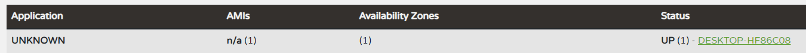
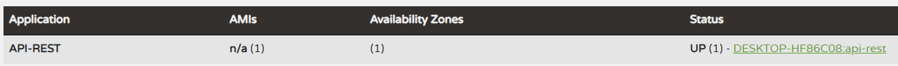

# Eureka Client

Una vez realiza la configuración del Servidor de Eureka, es necesario comenzar con la configuración de los microservicios para que se registren ante el servidor.

Para comenzar habría que cargar el módulo Spring de Eureka, en este caso sería Eureka Discovery Client:

También podríamos añadir a un proyecto existente la siguiente dependencia Maven:

```xml
<dependency>
    <groupId>org.springframework.cloud</groupId>
    <artifactId>spring-cloud-starter-netflix-eureka-client</artifactId>
    <version>4.1.0</version>
</dependency>
```

También se tendrá que añadir al fichero ``application.properties`` la siguiente línea:

```properties
eureka.client.serviceUrl.defaultZone=http://{hostname}:{puerto}/eureka/
```

Modificando los valores de ``hostname`` y ``puerto`` por los correspondientes del fichero ``application.properties`` del servidor.

En este caso, solo con añadir la dependencia es más que suficiente para que la aplicación se registre automáticamente frente al servidor.

Una vez añadida la dependencia, y con el servidor ejecutando, si ejecutamos el cliente y accedemos a la URL del servidor: ``localhost:8099/`` debería aparecer una instancia registrada de la siguiente forma:


Como se puede ver en la imagen, el microservicio está registrado como ``UNKNOWN``. Si queremos darle un nombre identificativo tendríamos que modificar el fichero application.properties añadiendo la siguiente línea:
```properties
spring.application.name=nombre-de-tu-aplicacion
```

De esta forma, al volver a ejecutar el programa este se registrará ante el servidor con el nuevo nombre:


