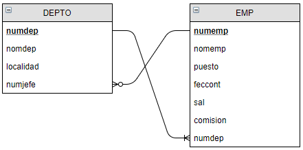

import Tabs from '@theme/Tabs';
import TabItem from '@theme/TabItem';

# Ejercicio 706

Realiza el ejercicio 704 solo que en lugar de implementar una API Rest se implemente una API utilizando GraphQL.

<details>
<summary>Resumen condiciones ejercicio 704</summary>


1. Implementar la siguiente base de datos MySQL:
   


La implementación de las tablas se realizará utilizando Java y JPA.

La relación de las tablase será:

    * 1 a varios ya que un empleado pertenece a un departamento y a un departamento pueden pertenecer varios empleados.
    * 1 a 1 ya que un empleado puede ser jefe de un departamento y un departamento tiene 1 jefe.
  
También se deberán tener en cuenta los siguientes aspectos a la hora de crear los campos y las entidades:

* Entidad Depto:
```sql	
numdep decimal(2,0) primary key, 
nomdep varchar(14) default NULL, 
localidad varchar(13) default NULL,
codjefe decimal(4,0) default NULL
```

* Entidad Emp
```sql
numemp decimal(4,0) primary key, 
nomemp varchar(10), 
puesto varchar(10), 
feccont date, 
sal decimal(7,2), 
comision decimal(7,2), 
numdep decimal(2,0) foreign key
```

2. Cargar los siguientes datos en la base de datos, se habilitará una URL para que el usuario los pueda cargar.
```sql
INSERT INTO depto VALUES (1,'CONTABILIDAD','SANTIAGO',7782); 
INSERT INTO depto VALUES (2,'ADMINISTRACION','VIGO',7369); 
INSERT INTO depto VALUES (3,'VENTAS','PONTEVEDRA',7499); 
INSERT INTO depto VALUES (4,'OPERACIONES','VILAGARCIA',7934); 


INSERT INTO emp VALUES (7369,'SMITH','CONTABLE', '1980-12-17' ,800.00, NULL, 2); 
INSERT INTO emp VALUES (7499,'ALLEN','COMERCIAL','1981-02-20' ,1600.00,300.00, 3); 
INSERT INTO emp VALUES (7521,'WARD','COMERCIAL', '1981-02-22' ,1250.00,500.00, 3); 
INSERT INTO emp VALUES (7566,'JONES','MANAGER',  '1981-04-02' ,2975.00,NULL, 2); 
INSERT INTO emp VALUES (7654,'MARTIN','COMERCIAL', '1981-09-28' ,1250.00,1400.00,3); 
INSERT INTO emp VALUES (7698,'BLAKE','MANAGER',  '1981-05-01' ,2850.00,NULL, 3); 
INSERT INTO emp VALUES (7782,'CLARK','MANAGER',  '1981-06-09' ,2450.00,NULL, 1); 
INSERT INTO emp VALUES (7788,'SCOTT','ANALISTA', '1982-12-09' ,3000.00,NULL, 2); 
INSERT INTO emp VALUES (7839,'KING','PRESIDENTE',  '1981-11-17' ,5000.00,NULL, 1); 
INSERT INTO emp VALUES (7844,'TURNER','COMERCIAL', '1981-09-08' ,1500.00,0.00, 3); 
INSERT INTO emp VALUES (7876,'ADAMS','CONTABLE',  '1983-01-12' ,1100.00,NULL, 2); 
INSERT INTO emp VALUES (7900,'JAMES','CONTABLE',  '1981-12-03' ,950.00, NULL, 3); 
INSERT INTO emp VALUES (7902,'FORD','ANALISTA',  '1981-12-03' ,3000.00,NULL, 2); 
INSERT INTO emp VALUES (7934,'MILLER','CONTABLE', '1982-01-23' ,1300.00,NULL, 1); 
```

3. Implementa los repositorios que extiendan de ``JpaRepository``

4. Crea el servicio y el controlador que permitan implementar una API Rest para realizar los siguientes apartados:
    * Cargar los datos anteriores
    * Realizar un CRUD básico para cada una de las tablas teniendo en cuenta el tipo de petición HTTP más adecuada.
    * Añadir empleado a un departamento.
    * Modificar el jefe de un departamento
    * Realizar las siguientes consultas:
      * **Consulta 1**: Obtén los nombres de los departamentos que no sean de ``VENTAS`` ni de ``ADMINISTRACION``, ordenados por localidad.
        ```sql
        select nomdep from depto where nomdep not in ('Ventas','administracion') order by localidad;
        ```
      * **Consulta 2**: Halla los datos de los empleados para los que o bien su nombre comienza por una cierta letra y su salario sea mayor a cierta cantidad, o bien, reciban comisión y trabajan e cierto departamento.
        ```sql
        select* from emp where (nomemp like 'A%' and sal>1000) or (comision is not null and numdep=3);
        ```
      * **Consulta 3**: Halla el nombre y la fecha de ingreso de los empleados que no son de un cierto puesto.
        ```sql
        select nomemp,puesto,feccont from emp where puesto!='COMERCIAL';
        ```
      * **Consulta 4**: Nombre de los empleados que tienen comisión
        ```sql
        select count(numemp) from emp where comision is not null;
        ```
      * **Consulta 5**: Halla los datos de los empleados cuyo salario es mayor que el de otro compañero, ordenando por el propio salario.
        ```sql
        select * from emp where sal>(select sal from emp where numemp=7934) order by sal;
        ```


</details>

Además, se deberá tener en cuenta los siguientes aspectos de configuración:

* El programa Spring deberá estar corriendo en el puerto ``8706``.
* La base de datos utilizada se llamará ``empleadosbd706``
* El nombre del programa será ``empleadosQL``.
* La API responderá a la petición en la ruta ``/empleadosql``
  
En cuanto a las dependencias del proyecto, será necesario utilizar:

* Spring Web
* Lombok
* Spring Data JPA y
* GraphQL
* MySQL Driver.

<details>
<summary>Solución</summary>

<Tabs>
<TabItem value="Entidades">
<Tabs>
<TabItem value="Consulta2DTO">
```java
package com.example1.entities;

import lombok.AllArgsConstructor;
import lombok.Data;
import lombok.NoArgsConstructor;

@Data
@AllArgsConstructor
@NoArgsConstructor
public class Consulta2DTO {
    private String letra;
    private double salario;
    private Long idDepartamento;
}

```
</TabItem>  
<TabItem value="Consulta3DTO">
```java
package com.example1.entities;

import lombok.AllArgsConstructor;
import lombok.Data;
import lombok.NoArgsConstructor;

import java.sql.Date;
import java.time.LocalDate;

@Data
@NoArgsConstructor
@AllArgsConstructor
public class Consulta3DTO {
    private String nombre;
    private LocalDate fecha;

    public Consulta3DTO(Emp emp){
        this.nombre = emp.getNomemp();
        this.fecha = emp.getFeccont();
    }
}

```
</TabItem>  
<TabItem value="DeptoDTO">
```java
package com.example1.entities;

import lombok.*;

@Getter
@Setter
public class DeptoDTO {
    private Long numdep;
    private String nomdep;
    private String localidad;
    private Long idJefe;

    public  DeptoDTO(Depto depto){
        this.numdep = depto.getNumdep();
        this.nomdep = depto.getNomdep();
        this.localidad = depto.getLocalidad();
        this.idJefe = depto.getJefe().getNumemp();
    }
}

```
</TabItem>  
<TabItem value="EmpDTO">
```java
package com.example1.entities;

import jakarta.persistence.*;
import lombok.*;

import java.math.BigDecimal;
import java.time.LocalDate;

@Getter
@Setter
public class EmpDTO {
    private Long numemp;
    private String nomemp;
    private String puesto;
    private LocalDate feccont;
    private BigDecimal sal;
    private BigDecimal comision;
    private Long iddepto;

    public EmpDTO (Emp emp){
        this.numemp = emp.getNumemp();
        this.nomemp = emp.getNomemp();
        this.puesto = emp.getPuesto();
        this.feccont = emp.getFeccont();
        this.sal = emp.getSal();
        this.comision = emp.getComision();
        this.iddepto = emp.getDepto().getNumdep();
    }
}

```
</TabItem>  
<TabItem value="Depto">
```java
package com.example1.entities;

import jakarta.persistence.*;
import lombok.*;

import java.util.ArrayList;
import java.util.List;

@Data
@RequiredArgsConstructor
@NoArgsConstructor
@Entity
@Table(name = "depto")
@EqualsAndHashCode(exclude = {"empleados", "jefe"})
public class Depto {

    @Id
    @GeneratedValue(strategy = GenerationType.IDENTITY)
    @Column(name = "numdep")
    private Long numdep;

    @NonNull
    @Column(name = "nomdep", length = 14)
    private String nomdep;

    @NonNull
    @Column(name = "localidad", length = 13)
    private String localidad;

    @OneToMany(mappedBy = "depto")
    @ToString.Exclude
    private List<Emp> empleados = new ArrayList<>();

    @OneToOne
    @JoinColumn(name = "codjefe")
    @ToString.Exclude
    private Emp jefe;

    public void anhadirEmpleado(Emp emp){
        this.empleados.add(emp);
        emp.setDepto(this);
    }

    public void addEmpleado(Emp emp) {
        this.empleados.add(emp);
    }

    public void anhadirJefe(Emp emp){
        this.jefe = emp;
        emp.setDeptoJefe(this);
    }
}

```
</TabItem>  
<TabItem value="Emp">
```java
package com.example1.entities;

import jakarta.persistence.*;
import lombok.*;

import java.math.BigDecimal;
import java.time.LocalDate;

@Data
@NoArgsConstructor
@RequiredArgsConstructor
@Entity
@Table(name = "emp")
@EqualsAndHashCode(exclude = {"depto", "deptoJefe"})
public class Emp {

    @Id
    @GeneratedValue(strategy = GenerationType.AUTO)
    @Column(name = "numep")
    private Long numemp;

    @NonNull
    @Column(length = 10)
    private String nomemp;

    @NonNull
    @Column(length = 10, nullable = false)
    private String puesto;

    @NonNull
    @Column(columnDefinition = "DATE")
    private LocalDate feccont;

    @NonNull
    @Column(name = "sal", precision = 7, scale = 2)
    private BigDecimal sal;

    @Column(name = "comision", precision = 7, scale = 2)
    private BigDecimal comision;

    @ManyToOne
    @JoinColumn(name = "numdep")
    @ToString.Exclude
    private Depto depto;

    @OneToOne(mappedBy = "jefe")
    @ToString.Exclude
    private Depto deptoJefe;

    public Emp(String nomemp, String puesto, LocalDate feccont, BigDecimal sal, BigDecimal comision) {
        this.nomemp = nomemp;
        this.puesto = puesto;
        this.feccont = feccont;
        this.sal = sal;
        this.comision = comision;
    }


    public void anhadirDepto(Depto depto){
        this.depto = depto;
        depto.addEmpleado(this);
    }

    public void anhadirJefe(Depto depto){
        this.deptoJefe = depto;
        depto.setJefe(this);
    }

}

```
</TabItem>  
</Tabs>
</TabItem>
<TabItem value="Repositorios">
<Tabs>
<TabItem value="DeptoRepository">
```java
package com.example1.repositories;

import com.example1.entities.Depto;
import org.springframework.data.jpa.repository.JpaRepository;
import org.springframework.data.jpa.repository.Query;
import org.springframework.data.repository.query.Param;
import org.springframework.stereotype.Repository;

import java.util.List;

@Repository
public interface DeptoRespository extends JpaRepository<Depto, Long> {

    @Query("select d from Depto d where d.nomdep not in (:nom1, :nom2)")
    List<Depto> findByNomdepIsNotAndNomdepIsNot(@Param("nom1") String nom1, @Param("nom2")  String nom2);
}

```
</TabItem>
<TabItem value="EmpRepository">
```java
package com.example1.repositories;

import com.example1.entities.Consulta2DTO;
import com.example1.entities.Consulta3DTO;
import com.example1.entities.Emp;
import org.springframework.data.jpa.repository.JpaRepository;
import org.springframework.data.jpa.repository.Query;
import org.springframework.data.repository.query.Param;
import org.springframework.stereotype.Repository;

import java.math.BigDecimal;
import java.util.List;

@Repository
public interface EmpRepository extends JpaRepository<Emp, Long> {
    @Query("select e from Emp e where (e.nomemp like :letra and e.sal > :salario) or (e.comision != null and e.deptoJefe.numdep = :idDep)")
    List<Emp> nombreEmpleadoLetraSalariooComicionDepartamento(@Param("letra") String letra,
                                                                 @Param("salario") double salario,
                                                                 @Param("idDep") Long idDep);

    @Query("select e from Emp e where e.puesto != :puesto")
    List<Emp> nombreyFechaEmpleadosNoPuesto(@Param("puesto") String puesto);

    List<Emp> findByComisionIsNotNull();

    @Query("select e from Emp e where e.sal > (select e1.sal from Emp e1 where e1.numemp=:id) order by sal")
    List<Emp> empleadosSalarioMayorASalariodeOtroCompanhero(@Param("id") Long id);
}

```
</TabItem>
</Tabs>
</TabItem>
<TabItem value="Servicios">
<Tabs>
<TabItem value="DeptoService">
```java
package com.example1.service;

import com.example1.entities.Depto;
import com.example1.entities.Emp;
import com.example1.repositories.DeptoRespository;
import com.example1.repositories.EmpRepository;
import lombok.RequiredArgsConstructor;
import org.springframework.stereotype.Service;

import java.util.List;

@Service
@RequiredArgsConstructor
public class DeptoService {

    private final DeptoRespository deptoRespository;

    public void guardar(Depto depto) {
        deptoRespository.save(depto);
    }

    public Depto addNewDepto(Depto depto){
        return deptoRespository.save(depto);
    }

    public Depto remove(Long id){
        Depto depto = deptoRespository.findById(id).orElse(null);
        deptoRespository.deleteById(id);
        return depto;
    }

    public Depto update(Depto depto){
        return deptoRespository.save(depto);
    }

    public List<Depto> findAll(){
        return deptoRespository.findAll();
    }

    public Depto findById(Long id) {
        return deptoRespository.findById(id).orElse(null);
    }

    public List<Depto> findByNomdepIsNotAndNomdepIsNot(String nomDep1, String nomDep2) {
        return deptoRespository.findByNomdepIsNotAndNomdepIsNot(nomDep1, nomDep2);
    }
}

```
</TabItem>
<TabItem value="EmpService">
```java
package com.example1.service;

import com.example1.entities.Consulta2DTO;
import com.example1.entities.Consulta3DTO;
import com.example1.entities.Depto;
import com.example1.entities.Emp;
import com.example1.repositories.DeptoRespository;
import com.example1.repositories.EmpRepository;
import lombok.RequiredArgsConstructor;
import org.springframework.stereotype.Service;

import java.util.List;
import java.util.Optional;
import java.util.stream.Collectors;

@Service
@RequiredArgsConstructor
public class EmpService {

    private final EmpRepository empRespository;

    public void guardar(Emp emp) {
        empRespository.save(emp);
    }

    public Emp addNewDepto(Emp emp){
        return empRespository.save(emp);
    }

    public Emp remove(Long id){
        Emp emp = empRespository.findById(id).orElse(null);
        empRespository.deleteById(id);
        return emp;
    }

    public Emp update(Emp emp){
        return empRespository.save(emp);
    }

    public List<Emp> findAll(){
        return empRespository.findAll();
    }

    public Emp findById(Long id) {
        return empRespository.findById(id).orElse(null);
    }

    public List<String> nombreEmpleadoLetraSalariooComicionDepartamento(Consulta2DTO datos) {
        return empRespository.nombreEmpleadoLetraSalariooComicionDepartamento(datos.getLetra() + "%",
                datos.getSalario(),
                datos.getIdDepartamento()).stream().map(Emp::getNomemp).collect(Collectors.toList());
    }

    public List<Emp> nombreyFechaEmpleadosNoPuesto(String puesto) {
        return empRespository.nombreyFechaEmpleadosNoPuesto(puesto);
    }

    public List<String> findByCominionNotNull() {
        return empRespository.findByComisionIsNotNull().stream().map(Emp::getNomemp).collect(Collectors.toList());
    }

    public List<Emp> empleadosSalarioMayorASalariodeOtroCompanhero(Long id) {
        return empRespository.empleadosSalarioMayorASalariodeOtroCompanhero(id);
    }
}

```
</TabItem>
</Tabs>
</TabItem>
<TabItem value="Ficheros generales">
<Tabs>
<TabItem value="AppController">
```java
package com.example1;

import com.example1.entities.*;
import com.example1.service.DeptoService;
import com.example1.service.EmpService;
import org.springframework.beans.factory.annotation.Autowired;
import org.springframework.data.jpa.repository.Query;
import org.springframework.graphql.data.method.annotation.Argument;
import org.springframework.graphql.data.method.annotation.MutationMapping;
import org.springframework.graphql.data.method.annotation.QueryMapping;
import org.springframework.stereotype.Controller;

import java.math.BigDecimal;
import java.time.LocalDate;
import java.util.ArrayList;
import java.util.List;
import java.util.stream.Collectors;

@Controller
public class AppController {

    @Autowired
    private DeptoService deptoService;
    @Autowired
    private EmpService empService;

    // Consultas
    @QueryMapping
    public List<DeptoDTO> consulta1(@Argument String nomDep1, @Argument String nomDep2){
        return deptoService.findByNomdepIsNotAndNomdepIsNot(nomDep1, nomDep2)
                .stream()
                .map(DeptoDTO::new)
                .collect(Collectors.toList());
    }

    @QueryMapping
    public List<String> consulta2(@Argument Consulta2DTO datos){
        return empService.nombreEmpleadoLetraSalariooComicionDepartamento(datos);
    }

    @QueryMapping
    public List<Consulta3DTO> consulta3(@Argument String puesto){
        return empService.nombreyFechaEmpleadosNoPuesto(puesto).stream().map(Consulta3DTO::new).collect(Collectors.toList());
    }

    @QueryMapping
    public List<String> consulta4(){
        return empService.findByCominionNotNull();
    }

    @QueryMapping
    public List<EmpDTO> consulta5(@Argument Long id){
        List<EmpDTO> listaEmpDto = empService.empleadosSalarioMayorASalariodeOtroCompanhero(id).stream()
                .map(EmpDTO::new).collect(Collectors.toList());
        return listaEmpDto;
    }

    @MutationMapping
    public DeptoDTO asignarDepartamento(@Argument Long idDept, @Argument Long idEmp ){
        Depto depto = deptoService.findById(idDept);
        Emp emp = empService.findById(idEmp);
        depto.anhadirEmpleado(emp);
        deptoService.guardar(depto);
        return new DeptoDTO(depto);
    }

    @MutationMapping
    public DeptoDTO modificarJefe(@Argument Long idDept, @Argument Long idEmp ){
        Depto depto = deptoService.findById(idDept);
        Emp emp = empService.findById(idEmp);
        depto.anhadirJefe(emp);
        deptoService.guardar(depto);
        return new DeptoDTO(depto);
    }

    // Funciones del Departamento

    @QueryMapping
    public List<Depto> obtenerDepartamentos() {
        return deptoService.findAll();
    }

    @QueryMapping
    public Depto obtenerDepartamentoPorId(@Argument Long id) {
        Depto departamento = deptoService.findById(id);
        return departamento;
    }

    @MutationMapping
    public String crearDepartamento(@Argument Depto departamento) {
        deptoService.guardar(departamento);
        return "Departamento guardado correctamente";
    }

    @MutationMapping
    public Depto modificarDepartamento(@Argument Long id, @Argument Depto departamentoActualizado) {
        Depto departamento = deptoService.findById(id);
        if (departamento != null) {
            departamentoActualizado.setNumdep(id);
            deptoService.guardar(departamento);
            return departamento;
        } else {
            return null;
        }
    }


    // Funciones del Empleado
    @QueryMapping
    public List<Emp> obtenerEmpleados() {
        return empService.findAll();
    }

    @QueryMapping
    public Emp obtenerEmpleadoPorId(@Argument Long id) {
        Emp empleado = empService.findById(id);
        return empleado;
    }

    @MutationMapping
    public String crearEmpleado(@Argument Emp empleado) {
        empService.guardar(empleado);
        return "Empleado guardado correctamente";
    }

    @MutationMapping
    public Emp modificarEmpleado(@Argument Long id, @Argument Emp empleadoActualizado) {
        Emp empleado = empService.findById(id);
        if (empleado != null) {
            empleadoActualizado.setNumemp(id);
            empService.guardar(empleadoActualizado);
            return empleadoActualizado;
        } else {
            return null;
        }
    }

    @MutationMapping
    public String cargarDatos(){
        ArrayList<Depto> listaDeptos = new ArrayList<>();
        ArrayList<Emp> listaEmp = new ArrayList<>();

        listaEmp.add(new Emp("SMITH", "CONTABLE", LocalDate.of(1980, 12, 17), new BigDecimal(800)));
        listaEmp.add(new Emp("ALLEN", "COMERCIAL", LocalDate.of(1981, 2, 20), new BigDecimal(1600), new BigDecimal(300)));
        listaEmp.add(new Emp("WARD", "COMERCIAL", LocalDate.of(1981, 2, 22), new BigDecimal(1250), new BigDecimal(500)));
        listaEmp.add(new Emp("JONES", "MANAGER", LocalDate.of(1981, 4, 2), new BigDecimal(2975)));
        listaEmp.add(new Emp("MARTIN", "COMERCIAL", LocalDate.of(1981, 9, 28), new BigDecimal(1250), new BigDecimal(1400)));
        listaEmp.add(new Emp("BLAKE", "MANAGER", LocalDate.of(1981, 5, 1), new BigDecimal(2850)));
        listaEmp.add(new Emp("CLARK", "MANAGER", LocalDate.of(1981, 6, 9), new BigDecimal(2450)));
        listaEmp.add(new Emp("SCOTT", "ANALISTA", LocalDate.of(1982, 12, 9), new BigDecimal(3000)));
        listaEmp.add(new Emp("KING", "PRESIDENTE", LocalDate.of(1981, 11, 17), new BigDecimal(5000)));
        listaEmp.add(new Emp("TURNER", "COMERCIAL", LocalDate.of(1981, 9, 8), new BigDecimal(1500), new BigDecimal(0)));
        listaEmp.add(new Emp("ADAMS", "CONTABLE", LocalDate.of(1983, 1, 12), new BigDecimal(1100)));
        listaEmp.add(new Emp("JAMES", "CONTABLE", LocalDate.of(1981, 12, 3), new BigDecimal(950)));
        listaEmp.add(new Emp("FORD", "ANALISTA", LocalDate.of(1981, 12, 3), new BigDecimal(3000)));
        listaEmp.add(new Emp("MILLER", "CONTABLE", LocalDate.of(1982, 1, 23), new BigDecimal(1300)));

        for (Emp emp: listaEmp)
            empService.guardar(emp);

        listaDeptos.add(new Depto("CONTABILIDAD", "SANTIAGO"));
        listaDeptos.add(new Depto("ADMINISTRACION", "VIGO"));
        listaDeptos.add(new Depto("VENTAS", "PONTEVEDRA"));
        listaDeptos.add(new Depto("OPERACIONES", "VILAGARCIA"));

        listaDeptos.get(0).anhadirJefe(listaEmp.get(6));
        deptoService.guardar(listaDeptos.get(0));
        listaDeptos.get(1).anhadirJefe(listaEmp.get(0));
        deptoService.guardar(listaDeptos.get(1));
        listaDeptos.get(2).anhadirJefe(listaEmp.get(1));
        deptoService.guardar(listaDeptos.get(2));
        listaDeptos.get(3).anhadirJefe(listaEmp.get(13));
        deptoService.guardar(listaDeptos.get(3));

        listaDeptos.get(0).anhadirEmpleado(listaEmp.get(6));
        listaDeptos.get(0).anhadirEmpleado(listaEmp.get(8));
        listaDeptos.get(0).anhadirEmpleado(listaEmp.get(13));

        listaDeptos.get(1).anhadirEmpleado(listaEmp.get(1));
        listaDeptos.get(1).anhadirEmpleado(listaEmp.get(3));
        listaDeptos.get(1).anhadirEmpleado(listaEmp.get(7));
        listaDeptos.get(1).anhadirEmpleado(listaEmp.get(10));
        listaDeptos.get(1).anhadirEmpleado(listaEmp.get(12));

        listaDeptos.get(2).anhadirEmpleado(listaEmp.get(1));
        listaDeptos.get(2).anhadirEmpleado(listaEmp.get(2));
        listaDeptos.get(2).anhadirEmpleado(listaEmp.get(4));
        listaDeptos.get(2).anhadirEmpleado(listaEmp.get(5));
        listaDeptos.get(2).anhadirEmpleado(listaEmp.get(9));
        listaDeptos.get(2).anhadirEmpleado(listaEmp.get(11));

        for (Depto depto : listaDeptos)
            deptoService.guardar(depto);

        return "Datos cargados correctamente";
    }

}

```
</TabItem>
<TabItem value="Application.java">
```java
package com.example1;

import org.springframework.boot.SpringApplication;
import org.springframework.boot.autoconfigure.SpringBootApplication;

@SpringBootApplication
public class Application {

	public static void main(String[] args) {
		SpringApplication.run(Application.class, args);
	}


}
```
</TabItem>
<TabItem value="application.properties">
```properties
spring.datasource.url=jdbc:mysql://localhost:3306/empleadosbd706?createDatabaseIfNotExist=true
spring.datasource.username=root
spring.datasource.password=abc123.
spring.jpa.database-platform=org.hibernate.dialect.MySQL8Dialect
spring.jpa.hibernate.ddl-auto=update
server.port=8706
spring.application.name=empleadosQL
spring.graphql.graphiql.enabled=true
```
</TabItem>
<TabItem value="schema.graphqls">
```graphql
type Mutation{
    cargarDatos : String
    asignarDepartamento (idDept : Float, idEmp : Float): DeptoDTO
    modificarJefe (idDept : Float, idEmp : Float): DeptoDTO

    crearDepartamento(departamento : DeptoInput): String
    modificarDepartamento(id : Float, departamentoActualizado : DeptoInput) : Depto
    crearEmpleado(empleado : EmpInput) : String
    modificarEmpleado(id : Float, empleadoActualizado : EmpInput) : Emp
}

type Query{
    consulta1(nomDep1 : String, nomDep2 : String) : [DeptoDTO]
    consulta2(datos: Consulta2DTO) : [String]
    consulta3(puesto : String) : [Consulta3DTO]
    consulta4 : [String]
    consulta5(id : Float) : [EmpDTO]

    obtenerDepartamentos : [Depto]
    obtenerDepartamentoPorId(id : Float) : Depto
    obtenerEmpleados : [Emp]
    obtenerEmpleadoPorId(id : Float) : Emp
}

type DeptoDTO{
    numdep : Float,
    nomdep : String,
    localidad: String,
    idJefe : Float
}

input Consulta2DTO{
    letra : String,
    salario: Float,
    idDepartamento : Float
}

type Consulta3DTO{
    nombre : String,
    fecha : String
}

type Depto{
    numdep : Float,
    nomdep : String,
    localidad : String
}

input DeptoInput{
    numdep : Float,
    nomdep : String,
    localidad : String
}

type Emp{
    numemp : Float,
    nomemp : String,
    puesto : String,
    feccont : String,
    sal : Float,
    comision : Float,
    depto : Depto,
    deptoJefe : Depto
}

input EmpInput{
    numemp : Float,
    nomemp : String,
    puesto : String,
    feccont : String,
    sal : Float,
    comision : Float
}

type EmpDTO{
    numemp : Float,
    nomemp : String,
    puesto : String,
    feccont : String,
    sal : Float,
    comision : Float,
    iddepto : Float,
}
```
</TabItem>

</Tabs>
</TabItem>
<TabItem value="Consultas">
<Tabs>
<TabItem value="Consulta1">
Obtén los nombres de los departamentos que no sean de VENTAS ni de ADMINISTRACION, ordenados por localidad.


```graphql
query{
  findByNomdepIsNotAndNomdepIsNot(nomDep1: "Ventas",
    nomDep2 : "administracion"){
    numdep, nomdep, localidad, idJefe
  }
}
```
</TabItem>
<TabItem value="Consulta2">
Halla los datos de los empleados para los que o bien su nombre comienza por una cierta letra y su salario sea mayor a cierta cantidad, o bien, reciban comisión y trabajan e cierto departamento.


```graphql
query{
  consulta2(
    datos : {
      letra: "A", 
      salario : 1000,
      idDepartamento : 1
    }
  )
}
```
</TabItem>
<TabItem value="Consulta3">
Halla el nombre y la fecha de ingreso de los empleados que no son de un cierto puesto.


```graphql
query{
  consulta3(puesto:"COMERCIAL"){
    nombre, fecha
  }
}
```
</TabItem>
<TabItem value="Consulta4">
Nombre de los empleados que tienen comisión


```graphql
query{
  consulta4
}
```
</TabItem>
<TabItem value="Consulta5">
Halla los datos de los empleados cuyo salario es mayor que el de otro compañero, ordenando por el propio salario.


```graphql
query{
  consulta5(id:2) {
    numemp
    nomemp
    puesto
    feccont
    sal
    comision
    iddepto
  }
}
```
</TabItem>
<TabItem value="Añadir empleado">
```graphql
  mutation{
    asignarDepartamento(idDept:1, idEmp:3){
      numdep, nomdep, localidad, idJefe
    }
  }
```
</TabItem>
<TabItem value="Modificar jefe">
```graphql
  mutation{
    modificarJefe(idEmp: 5, idDept: 3){
      numdep, nomdep, localidad, idJefe
    }
  }
```
</TabItem>
</Tabs>
</TabItem>
</Tabs>

</details>


<details>
<summary>Solución</summary>

<Tabs>
<TabItem value="Entidades">
<Tabs>
<TabItem value="Consulta2DTO">
```java
```
</TabItem>  
<TabItem value="Consulta3DTO">
```java
```
</TabItem>  
<TabItem value="DeptoDTO">
```java
```
</TabItem>  
<TabItem value="EmpDTO">
```java
```
</TabItem>  
<TabItem value="Depto">
```java
```
</TabItem>  
<TabItem value="Emp">
```java
```
</TabItem>  
</Tabs>
</TabItem>
<TabItem value="Repositorios">
<Tabs>
<TabItem value="DeptoRepository">
```java
```
</TabItem>
<TabItem value="EmpRepository">
```java
```
</TabItem>
</Tabs>
</TabItem>
<TabItem value="Servicios">
<Tabs>
<TabItem value="DeptoService">
```java
```
</TabItem>
<TabItem value="EmpService">
```java
```
</TabItem>
</Tabs>
</TabItem>
<TabItem value="Ficheros generales">
<Tabs>
<TabItem value="AppController">
```java
```
</TabItem>
<TabItem value="Application.java">
```java
```
</TabItem>
<TabItem value="application.properties">
```properties
```
</TabItem>
<TabItem value="schema.graphqls">
```java
```
</TabItem>

</Tabs>
</TabItem>
<TabItem value="Consultas">
<Tabs>
<TabItem value="Consulta1">
```java
```
</TabItem>
<TabItem value="Consulta2">
```java
```
</TabItem>
<TabItem value="Consulta3">
```java
```
</TabItem>
<TabItem value="Consulta4">
```java
```
</TabItem>
<TabItem value="Consulta5">
```java
```
</TabItem>
<TabItem value="Añadir empleado">
```java
```
</TabItem>
<TabItem value="Modificar jefe">
```java
```
</TabItem>
</Tabs>
</TabItem>
</Tabs>

</details>