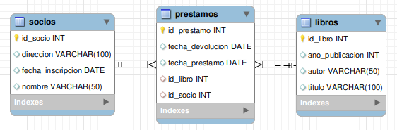

import Tabs from '@theme/Tabs';
import TabItem from '@theme/TabItem';

# Ejercicio 707

Realiza el ejercicio 704 solo que en lugar de implementar una API Rest se implemente una API utilizando GraphQL.

<details>
<summary>Resumen condiciones ejercicio 705</summary>

1. Implementar la siguiente base de datos MySQL:



La implementación de las tablas se realizará utilizando Java y JPA.

La relación de las tablase será:

* 1 a varios entre libros y préstamos: ya que un libro está relacionado con varios préstamos y cada préstamo está asociado a un solo libro.
* 1 a varios entre socio y préstamos: ya que un socio puede tener varios préstamos y un préstamos está asociado a un solo socio.
  
También se deberán tener en cuenta los siguientes aspectos a la hora de crear los campos y las entidades:

* Entidad libros:

```sql
id_libro INT PRIMARY KEY,
titulo VARCHAR(100),
autor VARCHAR(50),
ano_publicacion INT
```

* Entidad socios:

```sql
id_socio INT PRIMARY KEY,
nombre VARCHAR(50),
direccion VARCHAR(100),
fecha_inscripcion DATE
```

* Entidad prestamos:

```sql
id_prestamo INT PRIMARY KEY,
id_libro INT,
id_socio INT,
fecha_prestamo DATE,
fecha_devolucion DATE,
FOREIGN KEY (id_libro) REFERENCES libros(id_libro),
FOREIGN KEY (id_socio) REFERENCES socios(id_socio)
```

2. Cargar los siguientes datos en la base de datos, se habilitará una URL para que el usuario los pueda cargar.
```sql
INSERT INTO libros (id_libro, titulo, autor, ano_publicacion)
VALUES
    (1, 'El Señor de los Anillos', 'J.R.R. Tolkien', 1954),
    (2, 'Cien años de soledad', 'Gabriel García Márquez', 1967),
    (3, 'Harry Potter y la piedra filosofal', 'J.K. Rowling', 1997);

INSERT INTO socios (id_socio, nombre, direccion, fecha_inscripcion)
VALUES
    (101, 'Ana García', 'Calle 321, Ciudad X', '2022-01-01'),
    (102, 'Carlos Martínez', 'Avenida 654, Ciudad Y', '2021-12-15'),
    (103, 'Elena Pérez', 'Calle 987, Ciudad Z', '2022-02-10');

INSERT INTO prestamos (id_prestamo, id_libro, id_socio, fecha_prestamo, fecha_devolucion)
VALUES
    (1001, 1, 101, '2022-02-01', '2022-03-01'),
    (1002, 2, 102, '2022-01-15', '2022-02-15'),
    (1003, 3, 103, '2022-03-10', '2022-04-10');
```

3. Implementa los repositorios que extiendan de ``JpaRepository``

4. Crea el servicio y el controlador que permitan implementar una API Rest para realizar las siguientes consultas:

* Consulta 1: Listar todos los libros prestados, junto con los detalles de los socios:
```sql	
SELECT libros.*, socios.nombre AS nombre_socio, socios.direccion AS direccion_socio
FROM libros
JOIN prestamos ON libros.id_libro = prestamos.id_libro
JOIN socios ON prestamos.id_socio = socios.id_socio;
```

* Consulta 2: Encontrar los libros prestados actualmente y que aún no han sido devueltos:
```sql
SELECT libros.titulo, socios.nombre AS nombre_socio, prestamos.fecha_prestamo, prestamos.fecha_devolucion
FROM libros
JOIN prestamos ON libros.id_libro = prestamos.id_libro
JOIN socios ON prestamos.id_socio = socios.id_socio
WHERE prestamos.fecha_devolucion IS NULL;
```

* Consulta 3: Contar cuántos libros ha prestado cada socio:
```sql
SELECT socios.nombre, COUNT(prestamos.id_libro) AS total_libros_prestados
FROM socios
LEFT JOIN prestamos ON socios.id_socio = prestamos.id_socio
GROUP BY socios.id_socio, socios.nombre;
```

* Consulta 4: Encontrar los socios que tienen libros vencidos (devolución después de la fecha límite):
```sql
SELECT socios.nombre, prestamos.fecha_devolucion
FROM socios
JOIN prestamos ON socios.id_socio = prestamos.id_socio
WHERE prestamos.fecha_devolucion > prestamos.fecha_prestamo;
```

* Consulta 5: Listar los libros que nunca han sido prestados:
```sql
SELECT libros.*
FROM libros
LEFT JOIN prestamos ON libros.id_libro = prestamos.id_libro
WHERE prestamos.id_libro IS NULL;
```

* Consulta 6: Encontrar los socios que han prestado más de un libro:
```sql
SELECT socios.id_socio, socios.nombre, COUNT(prestamos.id_libro) AS total_libros_prestados
FROM socios
JOIN prestamos ON socios.id_socio = prestamos.id_socio
GROUP BY socios.id_socio, socios.nombre
HAVING COUNT(prestamos.id_libro) > 1;
```

* Consulta 7: Listar los libros junto con la cantidad de veces que han sido prestados:
```sql
SELECT libros.titulo, COUNT(prestamos.id_libro) AS total_prestamos
FROM libros
LEFT JOIN prestamos ON libros.id_libro = prestamos.id_libro
GROUP BY libros.id_libro, libros.titulo;
```

* Consulta 8: Encontrar los libros prestados en un rango de fechas específico:
```sql
SELECT libros.titulo, prestamos.fecha_prestamo, prestamos.fecha_devolucion
FROM libros
JOIN prestamos ON libros.id_libro = prestamos.id_libro
WHERE prestamos.fecha_prestamo BETWEEN '2022-01-01' AND '2022-02-01';

```

* Consulta 9: Buscar los libros prestados por un socio específico
```sql
SELECT libros.titulo, prestamos.fecha_prestamo, prestamos.fecha_devolucion
FROM libros
JOIN prestamos ON libros.id_libro = prestamos.id_libro
JOIN socios ON prestamos.id_socio = socios.id_socio
WHERE socios.id_socio = 101;
```

</details>

Además, se deberá tener en cuenta los siguientes aspectos de configuración:

* El programa Spring deberá estar corriendo en el puerto ``8707``.
* La base de datos utilizada se llamará ``librosQL707``
* El nombre del programa será ``librosQL``.
  
En cuanto a las dependencias del proyecto, será necesario utilizar:

* Spring Web
* Lombok
* Spring Data JPA y
* GraphQL
* MySQL Driver.

<details>
<summary>Solución</summary>

<Tabs>
<TabItem value="DTO">
<Tabs>
<TabItem value="Consulta1DTO">
```java
package com.example1.dto;

import com.example1.entities.Libro;
import jakarta.persistence.Column;
import lombok.Data;
import lombok.NonNull;

@Data
public class Consulta1DTO {
    private int idLibro;
    private String titulo;
    private String autor;
    private int anhoPublicacion;
    private String nombreSocio;
    private String direccionSocio;

    public Consulta1DTO(Libro l, String nombreSocio, String direccionSocio){
        this.idLibro = l.getIdLibro();
        this.titulo = l.getTitulo();
        this.autor = l.getAutor();
        this.anhoPublicacion = l.getAnhoPublicacion();
        this.nombreSocio = nombreSocio;
        this.direccionSocio = direccionSocio;
    }
}

```
</TabItem>  
<TabItem value="Consulta2DTO">
```java
package com.example1.dto;

import lombok.AllArgsConstructor;
import lombok.Data;

import java.time.LocalDate;

@Data
@AllArgsConstructor
public class Consulta2DTO {
    private String titulo;
    private String nombreSocio;
    private LocalDate fechaPrestamo;
    private LocalDate fechaDevolucion;

}

```
</TabItem>  
<TabItem value="Consulta3DTO">
```java
package com.example1.dto;

import lombok.AllArgsConstructor;
import lombok.Data;

import java.time.LocalDate;

@Data
@AllArgsConstructor
public class Consulta3DTO {
    private String titulo;
    private Long cuenta;
}

```
</TabItem>  
<TabItem value="Consulta4DTO">
```java
package com.example1.dto;

import lombok.AllArgsConstructor;
import lombok.Data;

import java.time.LocalDate;

@Data
@AllArgsConstructor
public class Consulta4DTO {
    private String nombre;
    private LocalDate fechDevolucion;
}

```
</TabItem>  
<TabItem value="Consulta6DTO">
```java
package com.example1.dto;

import lombok.AllArgsConstructor;
import lombok.Data;

import java.time.LocalDate;

@Data
@AllArgsConstructor
public class Consulta6DTO {
    private int idSocio;
    private String nombre;
    private Long fechDevolucion;
}

```
</TabItem>  
<TabItem value="Consulta8DTO">
```java
package com.example1.dto;

import lombok.AllArgsConstructor;
import lombok.Data;

import java.time.LocalDate;

@Data
@AllArgsConstructor
public class Consulta8DTO {
    private String titulo;
    private LocalDate fechaPrestamo;
    private LocalDate fechDevolucion;
}

```
</TabItem>  
</Tabs>
</TabItem>
<TabItem value="Entidades">
<Tabs>
<TabItem value="Libro">
```java
package com.example1.entities;

import jakarta.persistence.*;
import lombok.*;

import java.util.ArrayList;
import java.util.List;

@Data
@RequiredArgsConstructor
@NoArgsConstructor
@Entity
@Table(name="libros")
@EqualsAndHashCode(exclude = {"listaPrestamo"})
public class Libro {
    @Id
    @GeneratedValue(strategy = GenerationType.AUTO)
    @Column(name = "id_libro")
    private int idLibro;

    @NonNull
    @Column(length = 100)
    private String titulo;

    @NonNull
    @Column(length = 50)
    private String autor;

    @NonNull
    @Column(name = "ano_publicacion")
    private int anhoPublicacion;

    @OneToMany(mappedBy = "libro")
    private List<Prestamo> listaPrestamo = new ArrayList<>();

    public void addPrestamo(Prestamo prestamo) {
        this.listaPrestamo.add(prestamo);
    }
}

```
</TabItem>
<TabItem value="Prestamo">
```java
package com.example1.entities;

import jakarta.persistence.*;
import lombok.*;
import org.springframework.cglib.core.Local;

import java.time.LocalDate;

@Data
@NoArgsConstructor
@RequiredArgsConstructor
@Entity
@Table(name="prestamos")
@EqualsAndHashCode(exclude = {"socio", "libro"})
public class Prestamo {
    @Id
    @GeneratedValue(strategy = GenerationType.AUTO)
    @Column(name = "id_prestamo")
    private int idPrestamo;

    @NonNull
    @Column(name = "fecha_prestamo", columnDefinition = "DATE")
    private LocalDate fechaPrestamo;

    @NonNull
    @Column(name = "fecha_devolucion", columnDefinition = "DATE")
    private LocalDate fechaDevolucion;

    @ManyToOne
    @JoinColumn(name = "id_socio")
    private Socio socio;

    @ManyToOne
    @JoinColumn(name = "id_libro")
    private Libro libro;

    public Prestamo(LocalDate fechaPrestamo){
        this.fechaPrestamo = fechaPrestamo;
    }

    public void anhadirLibro(Libro libro) {
        this.libro = libro;
        libro.addPrestamo(this);
    }

    public void anhadirSocio(Socio socio) {
        this.socio = socio;
        socio.addPrestamo(this);
    }
}

```
</TabItem>
<TabItem value="Socio">
```java
package com.example1.entities;

import jakarta.persistence.*;
import lombok.*;

import java.time.LocalDate;
import java.util.ArrayList;
import java.util.List;

@Data
@RequiredArgsConstructor
@NoArgsConstructor
@Entity
@Table(name = "socios")
@EqualsAndHashCode(exclude = {"listaPrestamos"})
public class Socio {
    @Id
    @GeneratedValue(strategy = GenerationType.AUTO)
    @Column(name = "id_socio")
    private int idSocio;

    @NonNull
    @Column(length = 50)
    private String nombre;

    @NonNull
    @Column(length = 100)
    private String direccion;

    @NonNull
    @Column(name = "fecha_inscripcion", columnDefinition = "DATE")
    private LocalDate fechaInscripcion;

    @OneToMany(mappedBy = "socio")
    private List<Prestamo> listaPrestamos = new ArrayList<>();

    public void addPrestamo(Prestamo prestamo) {
        this.listaPrestamos.add(prestamo);
    }
}

```
</TabItem>

</Tabs>
</TabItem>
<TabItem value="Repositorios">
<Tabs>
<TabItem value="LibroRespository">
```java
package com.example1.repositories;

import com.example1.entities.Libro;
import org.springframework.data.jpa.repository.JpaRepository;
import org.springframework.data.jpa.repository.Query;
import org.springframework.data.repository.query.Param;
import org.springframework.stereotype.Repository;

import java.time.LocalDate;
import java.util.List;

@Repository
public interface LibroRespository extends JpaRepository<Libro, Integer> {

    @Query("select l, s.nombre, s.direccion from Libro l JOIN Prestamo p ON l.idLibro = p.libro.idLibro JOIN Socio s ON p.socio.idSocio = s.idSocio")
    public List<Object[]> consulta1();

    @Query("select l.titulo, s.nombre, p.fechaPrestamo, p.fechaDevolucion " +
            "from Libro l JOIN Prestamo p ON l.idLibro = p.libro.idLibro " +
            "JOIN Socio s ON p.socio.idSocio = s.idSocio " +
            "where p.fechaDevolucion is null")
    public List<Object[]> consulta2();

    @Query("select l " +
            "from Libro l LEFT JOIN Prestamo p ON l.idLibro = p.libro.idLibro " +
            "where p.libro.idLibro is null")
    public List<Libro> consulta5();

    @Query("select l.titulo, COUNT(p.libro.idLibro) " +
            "from Libro l LEFT JOIN Prestamo p ON l.idLibro = p.libro.idLibro " +
            "group by l.idLibro, l.titulo")
    public List<Object[]> consulta7();

    @Query("select l.titulo, p.fechaPrestamo, p.fechaDevolucion from Libro l" +
            " JOIN Prestamo p ON l.idLibro = p.libro.idLibro " +
            "where p.fechaPrestamo between :fecha1 and :fecha2")
    public List<Object[]> consulta8(@Param("fecha1")LocalDate fecha1, @Param("fecha2") LocalDate fecha2);

    @Query("select l.titulo, p.fechaPrestamo, p.fechaDevolucion from Libro l" +
            " JOIN Prestamo p ON l.idLibro = p.libro.idLibro " +
            "JOIN Socio s ON p.socio.idSocio = s.idSocio " +
            "where s.idSocio = :socio")
    public List<Object[]> consulta9(@Param("socio") int idSocio);
}

```
</TabItem>
<TabItem value="PrestamoRepository">
```java
package com.example1.repositories;

import com.example1.entities.Prestamo;
import org.springframework.data.jpa.repository.JpaRepository;
import org.springframework.stereotype.Repository;

@Repository
public interface PrestamoRepository extends JpaRepository<Prestamo, Integer> {
}

```
</TabItem>
<TabItem value="SocioRepository">
```java
package com.example1.repositories;

import com.example1.entities.Socio;
import org.springframework.data.jpa.repository.JpaRepository;
import org.springframework.data.jpa.repository.Query;
import org.springframework.stereotype.Repository;

import java.util.List;

@Repository
public interface SocioRepository extends JpaRepository<Socio, Integer> {

    @Query("select s.nombre, COUNT(p.libro.idLibro) " +
            "from Socio s left JOIN Prestamo p ON s.idSocio = p.socio.idSocio " +
            "GROUP BY s.idSocio, s.nombre")
    public List<Object[]> consulta3();

    @Query("select s.nombre, p.fechaDevolucion " +
            "from Socio s JOIN Prestamo p ON s.idSocio = p.socio.idSocio " +
            "where p.fechaDevolucion > p.fechaPrestamo")
    public List<Object[]> consulta4();

    @Query("select s.idSocio, s.nombre, COUNT(p.libro.idLibro) " +
            "from Socio s JOIN Prestamo p ON s.idSocio = p.socio.idSocio " +
            "group by s.idSocio, s.nombre " +
            "having count(p.libro.idLibro) > 1")
    public List<Object[]> consulta6();
}

```
</TabItem>

</Tabs>
</TabItem>
<TabItem value="Servicios">
<Tabs>
<TabItem value="LibroService">
```java
package com.example1.service;

import com.example1.dto.Consulta1DTO;
import com.example1.dto.Consulta2DTO;
import com.example1.dto.Consulta3DTO;
import com.example1.dto.Consulta8DTO;
import com.example1.entities.*;
import com.example1.repositories.LibroRespository;
import lombok.RequiredArgsConstructor;
import org.springframework.stereotype.Service;

import java.time.LocalDate;
import java.util.List;
import java.util.stream.Collectors;

@Service
@RequiredArgsConstructor
public class LibroService {

    private final LibroRespository libroRespository;

    public void guardar(Libro libro) {
        libroRespository.save(libro);
    }

    public List<Consulta1DTO> consulta1() {
        List<Object[]> resultadoConsulta = libroRespository.consulta1();
        return resultadoConsulta.stream().map(obj -> new Consulta1DTO((Libro) obj[0], (String) obj[1], (String) obj[2])).collect(Collectors.toList());
    }

    public List<Consulta2DTO> consulta2() {
        List<Object[]> resultadoConsulta = libroRespository.consulta2();
        return resultadoConsulta.stream().map(obj -> new Consulta2DTO((String) obj[0], (String) obj[1], (LocalDate) obj[2], (LocalDate) obj[3])).collect(Collectors.toList());
    }

    public List<Libro> consulta5() {
        return libroRespository.consulta5();
    }

    public List<Consulta3DTO> consulta7() {
        List<Object[]> resultadoConsulta = libroRespository.consulta7();
        return resultadoConsulta.stream().map(obj -> new Consulta3DTO((String) obj[0], (Long) obj[1])).collect(Collectors.toList());
    }
    public List<Consulta8DTO> consulta8(LocalDate fecha1, LocalDate fecha2) {
        List<Object[]> resultadoConsulta = libroRespository.consulta8(fecha1, fecha2);
        return resultadoConsulta.stream().map(obj -> new Consulta8DTO((String) obj[0], (LocalDate) obj[1], (LocalDate) obj[2])).collect(Collectors.toList());
    }
    public List<Consulta8DTO> consulta9(int idSocio) {
        List<Object[]> resultadoConsulta = libroRespository.consulta9(idSocio);
        return resultadoConsulta.stream().map(obj -> new Consulta8DTO((String) obj[0], (LocalDate) obj[1], (LocalDate) obj[2])).collect(Collectors.toList());
    }
}

```
</TabItem>
<TabItem value="PrestamoService">
```java
package com.example1.service;

import com.example1.entities.Prestamo;
import com.example1.repositories.PrestamoRepository;
import lombok.RequiredArgsConstructor;
import org.springframework.stereotype.Service;

@Service
@RequiredArgsConstructor
public class PrestamoService {

    private final PrestamoRepository prestamoRespository;

    public void guardar(Prestamo prestamo) {
        prestamoRespository.save(prestamo);
    }

}

```
</TabItem>
<TabItem value="SocioService">
```java
package com.example1.service;

import com.example1.dto.Consulta3DTO;
import com.example1.dto.Consulta4DTO;
import com.example1.dto.Consulta6DTO;
import com.example1.entities.*;
import com.example1.repositories.SocioRepository;
import lombok.RequiredArgsConstructor;
import org.springframework.stereotype.Service;

import java.time.LocalDate;
import java.util.List;
import java.util.stream.Collectors;

@Service
@RequiredArgsConstructor
public class SocioService {

    private final SocioRepository socioRespository;

    public void guardar(Socio socio) {
        socioRespository.save(socio);
    }

    public List<Consulta3DTO> consulta3() {
        List<Object[]> resultadoConsulta1 = socioRespository.consulta3();
        return resultadoConsulta1.stream().map(obj -> new Consulta3DTO((String) obj[0], (Long) obj[1])).collect(Collectors.toList());
    }

    public List<Consulta4DTO> consulta4() {
        List<Object[]> resultadoConsulta1 = socioRespository.consulta4();
        return resultadoConsulta1.stream().map(obj -> new Consulta4DTO((String) obj[0], (LocalDate) obj[1])).collect(Collectors.toList());
    }

    public List<Consulta6DTO> consulta6() {
        List<Object[]> resultadoConsulta1 = socioRespository.consulta6();
        return resultadoConsulta1.stream().map(obj -> new Consulta6DTO((Integer) obj[0], (String) obj[1], (Long) obj[2])).collect(Collectors.toList());
    }

}

```
</TabItem>


</Tabs>
</TabItem>
<TabItem value="Ficheros generales">
<Tabs>
<TabItem value="AppController">
```java
package com.example1;

import com.example1.dto.*;
import com.example1.entities.*;
import com.example1.service.LibroService;
import com.example1.service.SocioService;
import com.example1.service.PrestamoService;
import org.springframework.beans.factory.annotation.Autowired;
import org.springframework.graphql.data.method.annotation.Argument;
import org.springframework.graphql.data.method.annotation.MutationMapping;
import org.springframework.graphql.data.method.annotation.QueryMapping;
import org.springframework.stereotype.Controller;
import org.springframework.web.bind.annotation.*;

import java.time.LocalDate;
import java.time.format.DateTimeFormatter;
import java.util.ArrayList;
import java.util.List;

@Controller
public class AppController {

    @Autowired
    private SocioService socioService;
    @Autowired
    private PrestamoService prestamoService;
    @Autowired
    private LibroService libroService;

    @QueryMapping
    public List<Consulta1DTO> consulta1(){
        return libroService.consulta1();
    }

    @QueryMapping
    public List<Consulta2DTO> consulta2(){
        return libroService.consulta2();
    }

    @QueryMapping
    public List<Consulta3DTO> consulta3(){
        return socioService.consulta3();
    }

    @QueryMapping
    public List<Consulta4DTO> consulta4(){
        return socioService.consulta4();
    }

    @QueryMapping
    public List<Libro> consulta5(){
        return libroService.consulta5();
    }

    @QueryMapping
    public List<Consulta6DTO> consulta6(){
        return socioService.consulta6();
    }

    @QueryMapping
    public List<Consulta3DTO> consulta7(){
        return libroService.consulta7();
    }

    @QueryMapping
    public List<Consulta8DTO> consulta8(@Argument String fecha1, @Argument String fecha2){
        DateTimeFormatter formatter = DateTimeFormatter.ofPattern("yyyy-MM-dd");
        LocalDate f1 = LocalDate.parse(fecha1, formatter);
        LocalDate f2 = LocalDate.parse(fecha2, formatter);
        return libroService.consulta8(f1, f2);
    }

    @QueryMapping
    public List<Consulta8DTO> consulta9(@Argument int id){
        return libroService.consulta9(id);
    }

    @MutationMapping
    public String cargarDatos(){
        ArrayList<Libro> listaLibros = new ArrayList<>();
        ArrayList<Prestamo> listaPrestamos = new ArrayList<>();
        ArrayList<Socio> listaSocios = new ArrayList<>();

        listaLibros.add(new Libro("El Señor de los Anillos", "J.R.R. Tolkien", 1954));
        listaLibros.add(new Libro("Cien años de soledad", "Gabriel García Márquez", 1967));
        listaLibros.add(new Libro("Harry Potter y la piedra filosofal", "J.K. Rowling", 1997));
        listaLibros.add(new Libro("Libro X", "Autor X", 2002));
        listaLibros.add(new Libro("Libro Y", "Autora Y", 2007));

        for (Libro libro: listaLibros)
            libroService.guardar(libro);

        listaSocios.add(new Socio("Ana García", "Calle 321, Ciudad X", LocalDate.of(2022, 1, 1)));
        listaSocios.add(new Socio("Carlos Martínez", "Avenida 654, Ciudad Y", LocalDate.of(2022, 12, 15)));
        listaSocios.add(new Socio("Elena Pérez", "Calle 987, Ciudad Z", LocalDate.of(2022, 2, 10)));

        for (Socio socio: listaSocios)
            socioService.guardar(socio);

        listaPrestamos.add(new Prestamo(LocalDate.of(2022, 2, 1), LocalDate.of(2022, 3, 1)));
        listaPrestamos.add(new Prestamo(LocalDate.of(2022, 1, 15), LocalDate.of(2022, 2, 15)));
        listaPrestamos.add(new Prestamo(LocalDate.of(2022, 3, 10), LocalDate.of(2022, 4, 10)));
        listaPrestamos.add(new Prestamo(LocalDate.of(2022, 3, 10)));

        listaPrestamos.get(0).anhadirLibro(listaLibros.get(0));
        listaPrestamos.get(0).anhadirSocio(listaSocios.get(0));
        listaPrestamos.get(1).anhadirLibro(listaLibros.get(1));
        listaPrestamos.get(1).anhadirSocio(listaSocios.get(1));
        listaPrestamos.get(2).anhadirLibro(listaLibros.get(2));
        listaPrestamos.get(2).anhadirSocio(listaSocios.get(2));
        listaPrestamos.get(3).anhadirLibro(listaLibros.get(4));
        listaPrestamos.get(3).anhadirSocio(listaSocios.get(2));

        for (Prestamo prestamo: listaPrestamos)
            prestamoService.guardar(prestamo);

        return "Datos cargados correctamente";
    }

}

```
</TabItem>
<TabItem value="Application.java">
```java
package com.example1;

import org.springframework.boot.SpringApplication;
import org.springframework.boot.autoconfigure.SpringBootApplication;

@SpringBootApplication
public class Application {

	public static void main(String[] args) {
		SpringApplication.run(Application.class, args);
	}

}
```
</TabItem>
<TabItem value="application.properties">
```properties
spring.datasource.url=jdbc:mysql://localhost:3306/librosQL707?createDatabaseIfNotExist=true
spring.datasource.username=root
spring.datasource.password=abc123.
spring.jpa.database-platform=org.hibernate.dialect.MySQL8Dialect
spring.jpa.hibernate.ddl-auto=update
server.port=8707
spring.application.name=librosQL
spring.graphql.graphiql.enabled=true
```
</TabItem>
<TabItem value="schema.graphqls">
```graphql
type Mutation{
    cargarDatos : String
}

type Query{
    consulta1 : [Consulta1DTO]
    consulta2 : [Consulta2DTO]
    consulta3 : [Consulta3DTO]
    consulta4 : [Consulta4DTO]
    consulta5 : [Libro]
    consulta6 : [Consulta6DTO]
    consulta7 : [Consulta3DTO]
    consulta8(fecha1 : String, fecha2 : String) : [Consulta8DTO]
    consulta9(id : Int) : [Consulta8DTO]
}

type Libro{
    idLibro : Int,
    titulo : String,
    autor : String,
    anhoPublicacion : Int,
    listaPrestamo : [Prestamo],
}

type Prestamo{
    idPrestamo : Int,
    fechaPrestamo : String,
    fechaDevolucion : String,
    socio : Socio,
    libro : Libro,
}

type Socio{
    idSocio : Int,
    nombre : String,
    direccion : String,
    fechaInscripcion : String,
    listaPrestamos : [Prestamo],
}

type Consulta1DTO{
    idLibro : Int,
    titulo : String,
    autor : String,
    anhoPublicacion : Int,
    nombreSocio : String,
    direccionSocio : String,
}

type Consulta2DTO{
    titulo : String,
    nombreSocio : String,
    fechaPrestamo : String,
    fechaDevolucion : String
}

type Consulta3DTO{
    titulo : String,
    cuenta : Float
}

type Consulta4DTO{
    nombre : String,
    fechDevolucion : String
}

type Consulta6DTO{
    idSocio : Int,
    nombre : String,
    fechDevolucion : Float
}

type Consulta8DTO{
    titulo : String,
    fechaPrestamo : String,
    fechDevolucion : String
}
```
</TabItem>

</Tabs>
</TabItem>
<TabItem value="Consultas">
<Tabs>
<TabItem value="Consulta1">
Listar todos los libros prestados, junto con los detalles de los socios:


```graphql
query{
    consulta1 {
        idLibro
        titulo
        autor
        anhoPublicacion
        nombreSocio
        direccionSocio
    }
}

```
</TabItem>
<TabItem value="Consulta2">
Encontrar los libros prestados actualmente y que aún no han sido devueltos:


```graphql
query{
    consulta2 {
        titulo
        nombreSocio
        fechaPrestamo
        fechaDevolucion
    }
}
```
</TabItem>
<TabItem value="Consulta3">
Contar cuántos libros ha prestado cada socio:


```graphql
  query{
    consulta3 {
        titulo
        cuenta
    }
}
```
</TabItem>
<TabItem value="Consulta4">
Encontrar los socios que tienen libros vencidos (devolución después de la fecha límite):


```graphql
query{
    consulta4 {
        nombre
        fechDevolucion
    }
}
```
</TabItem>
<TabItem value="Consulta5">
Listar los libros que nunca han sido prestados:


```graphql
query{
    consulta5 {
        idLibro
        titulo
        autor
        anhoPublicacion
    }
}
```
</TabItem>
<TabItem value="Consulta6">
Encontrar los socios que han prestado más de un libro:


```graphql
query{
    consulta6 {
        idSocio
        nombre
        fechDevolucion
    }
}
```
</TabItem>
<TabItem value="Consulta7">
Listar los libros junto con la cantidad de veces que han sido prestados:


```graphql
query{
    consulta7 {
        titulo
        cuenta
    }
}
```
</TabItem>
<TabItem value="Consulta8">
Encontrar los libros prestados en un rango de fechas específico:


```graphql
query{
    consulta8(fecha1 : "2022-01-01", fecha2:"2022-02-01") {
        titulo
        fechaPrestamo
        fechDevolucion
    }
}
```
</TabItem>
<TabItem value="Consulta9">
Buscar los libros prestados por un socio específico


```graphql
    query{
        consulta9(id :2) {
            titulo
            fechaPrestamo
            fechDevolucion
        }
    }
```
</TabItem>

</Tabs>
</TabItem>
</Tabs>

</details>