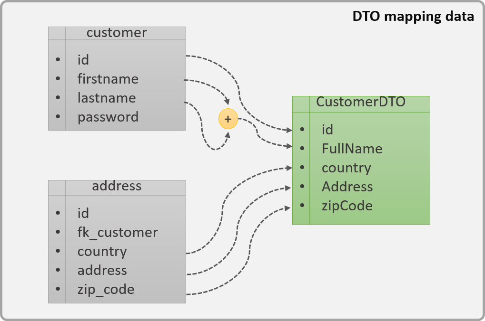

# Patrón DTO

:::tip PATRÓN DTO
El patrón DTO tiene como finalidad crear un objeto plano (POJO) con una serie de atributos que puedan ser enviados o recuperados del servidor en una sola invocación.

De tal forma que un DTO puede contener información de múltiples fuentes o tablas y concentrarlas en una única clase simple.
:::

En la imagen anterior podemos apreciar gráficamente como es la estructura de un DTO el cual está formado por más de una fuente de datos.

El servidor obtiene la información de las tablas ``customer`` y ``address`` (izquierda) y realiza un mapping con el DTO (derecha). La información puede ser pasada de dos formas:

* De **forma intacta**: como es el caso del ``id`` , ``fullName`` , ``country`` , ``address`` y ``zipCode``.
* **Derivada** o **transformada**: como es el caso del ``fullName`` , el cual es la unión del ``firstname`` y ``lastname`` .
  
Una de las ventajas de los DTO es permitir la omisión de información que no requiere el usuario o que pueden ocasionar fallas de seguridad, el caso más claro es el de ``password``.

# Entidades vs DTO

Un error frecuente es el hecho de utilizar las clases de Entidad como elemento de transmisión de datos entre el cliente y el servidor.

Las **entidades son clases que representa al modelo de datos**, o mapea directamente contra una tabla de la base de datos, estas no fueron diseñadas para ser una vista para una pantalla o servicio determinado. Además, no todos los atributos de una entidad tiene que poder ser serializables por lo que no son recomendables para su transmisión.

Es por eso que los DTO van surgiendo a medida que se van necesitando para ir filtrando y mapeando la información de las entidades para adecuarlas a lo que el usuario puede ver.

:::info MÁS INFORMACIÓN
Si se quiere conocer más sobre los DTO [aquí](https://www.oscarblancarteblog.com/2018/11/30/data-transfer-object-dto-patron-diseno/) podéis encontrar más información.

:::